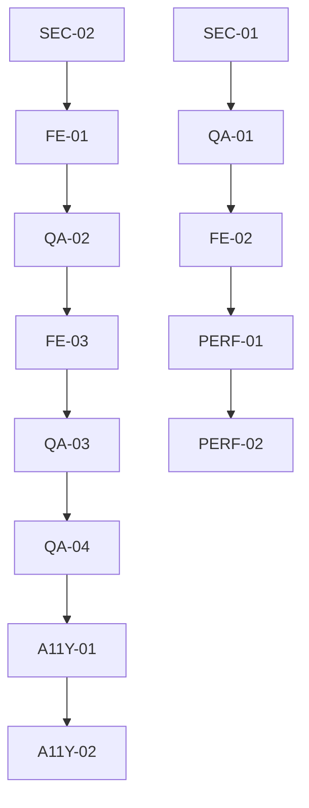

# Execution Timeline - Retail Portal Testing Campaign

## Timeline Overview

**Total Duration**: 28 days (4 weeks)
**Testing Window**: Monday to Sunday, 8 hours/day productive time
**Agent Capacity**: 13 specialized agents working in coordinated phases
**Critical Path**: Authentication → Products → Cart → Orders → Quality Validation

## Phase-Based Execution Strategy

### Phase 1: Foundation & Security (Week 1)
**Objective**: Establish secure, functional authentication and core navigation
**Quality Gate**: Users can securely log in and browse products

### Phase 2: Core Commerce (Week 2) 
**Objective**: Complete shopping and ordering functionality
**Quality Gate**: Users can successfully place orders end-to-end

### Phase 3: Experience & Performance (Week 3)
**Objective**: Optimize performance, accessibility, and multi-language support
**Quality Gate**: Application meets all performance and accessibility standards

### Phase 4: Validation & Launch Prep (Week 4)
**Objective**: Final security validation, integration testing, and launch readiness
**Quality Gate**: Production-ready application with full quality certification

## Daily Execution Schedule

### Week 1: Foundation & Security (Days 1-7)

#### Day 1 - Monday: Authentication Security Foundation
**Focus**: Secure authentication flows and baseline security

| Time | Agent | Primary Task | Deliverables | Handoff |
|------|-------|--------------|-------------|---------|
| 09:00-12:00 | SEC-01 | Login flow security testing | Authentication security report | QA-01 |
| 09:00-12:00 | SEC-02 | API endpoint security baseline | API security assessment | FE-01 |
| 13:00-17:00 | SEC-01 | Session management validation | Session security validation | QA-02 |
| 13:00-17:00 | SEC-02 | Input validation testing | Input security test results | FE-02 |

**End of Day Deliverables**:
- Authentication security validated
- Basic API security confirmed
- Session management tested
- Input validation baseline established

#### Day 2 - Tuesday: Product Catalog Foundation
**Focus**: Core product browsing and navigation

| Time | Agent | Primary Task | Deliverables | Handoff |
|------|-------|--------------|-------------|---------|
| 09:00-12:00 | QA-01 | Authentication test case execution | Login/signup test results | FE-01 |
| 09:00-12:00 | FE-01 | Product catalog UI validation | UI component test results | QA-02 |
| 13:00-17:00 | FE-02 | Responsive design validation | Mobile/desktop compatibility | PERF-01 |
| 13:00-17:00 | QA-02 | Product browsing flow testing | Navigation flow validation | FE-03 |

**End of Day Deliverables**:
- Authentication flows fully tested
- Product catalog UI validated
- Responsive design confirmed
- Basic navigation tested

#### Day 3 - Wednesday: Shopping Cart Foundation  
**Focus**: Cart functionality and state management

| Time | Agent | Primary Task | Deliverables | Handoff |
|------|-------|--------------|-------------|---------|
| 09:00-12:00 | FE-03 | Shopping cart UI implementation | Cart component validation | QA-03 |
| 09:00-12:00 | PERF-01 | Initial performance baseline | Performance metrics baseline | QA-04 |
| 13:00-17:00 | QA-03 | Cart functionality testing | Cart operation test results | A11Y-01 |
| 13:00-17:00 | QA-04 | Integration testing preparation | Integration test framework | PERF-02 |

**End of Day Deliverables**:
- Shopping cart functionality tested
- Performance baseline established
- Cart state management validated
- Integration framework ready

#### Day 4 - Thursday: Search & Performance
**Focus**: Product search and initial performance optimization

| Time | Agent | Primary Task | Deliverables | Handoff |
|------|-------|--------------|-------------|---------|
| 09:00-12:00 | FE-01 | Product search implementation | Search functionality test | QA-01 |
| 09:00-12:00 | PERF-02 | Mobile performance testing | Mobile performance metrics | FE-2 |
| 13:00-17:00 | QA-01 | Search functionality validation | Search test results | A11Y-01 |
| 13:00-17:00 | FE-2 | Performance UI optimization | UI performance improvements | QA-02 |

**End of Day Deliverables**:
- Product search validated
- Mobile performance tested
- UI performance optimized
- Search integration confirmed

#### Day 5 - Friday: Integration & Mobile Focus
**Focus**: Mobile interactions and cross-component integration

| Time | Agent | Primary Task | Deliverables | Handoff |
|------|-------|--------------|-------------|---------|
| 09:00-12:00 | FE-3 | Mobile gesture implementation | Mobile interaction validation | QA-03 |
| 09:00-12:00 | QA-02 | Cross-component integration | Integration test results | QA-4 |
| 13:00-17:00 | QA-03 | Mobile user journey testing | Mobile UX validation | PERF-01 |
| 13:00-17:00 | QA-4 | Data validation testing | Data integrity confirmation | A11Y-01 |

**End of Day Deliverables**:
- Mobile gestures working
- Component integration validated
- Mobile UX tested
- Data integrity confirmed

#### Weekend 1 (Days 6-7): Consolidation & Planning
**Focus**: Issue resolution and Week 2 preparation
- Bug fixes and issue resolution
- Week 1 quality gate assessment
- Week 2 planning and preparation
- Agent coordination and resource planning

### Week 2: Core Commerce (Days 8-14)

#### Day 8 - Monday: Order Management Foundation
**Focus**: Order placement and management systems

| Time | Agent | Primary Task | Deliverables | Handoff |
|------|-------|--------------|-------------|---------|
| 09:00-12:00 | QA-01 | Order management testing | Order flow validation | SEC-01 |
| 09:00-12:00 | QA-02 | Order placement validation | Checkout flow testing | FE-01 |
| 13:00-17:00 | SEC-01 | Order security validation | Order security assessment | PERF-01 |
| 13:00-17:00 | FE-01 | Order UI implementation | Order interface validation | QA-03 |

**End of Day Deliverables**:
- Order management tested
- Checkout flow validated
- Order security confirmed
- Order UI implemented

#### Day 9 - Tuesday: Order Processing & Confirmation
**Focus**: Order confirmation and status management

| Time | Agent | Primary Task | Deliverables | Handoff |
|------|-------|--------------|-------------|---------|
| 09:00-12:00 | QA-03 | End-to-end order testing | Complete order validation | A11Y-01 |
| 09:00-12:00 | PERF-01 | Order performance testing | Order process metrics | PERF-02 |
| 13:00-17:00 | A11Y-01 | Order accessibility testing | Order a11y validation | A11Y-02 |
| 13:00-17:00 | PERF-02 | Performance optimization | Performance improvements | FE-2 |

**End of Day Deliverables**:
- End-to-end orders working
- Order performance optimized
- Order accessibility validated
- Performance improvements applied

#### Day 10 - Wednesday: Error Handling & Edge Cases
**Focus**: Order error scenarios and edge case handling

| Time | Agent | Primary Task | Deliverables | Handoff |
|------|-------|--------------|-------------|---------|
| 09:00-12:00 | QA-4 | Order error scenario testing | Error handling validation | SEC-02 |
| 09:00-12:00 | FE-2 | Error UI implementation | Error state validation | QA-01 |
| 13:00-17:00 | SEC-02 | Payment security testing | Payment flow security | FE-3 |
| 13:00-17:00 | QA-01 | Edge case testing | Edge case validation | A11Y-01 |

**End of Day Deliverables**:
- Error scenarios tested
- Error UI validated
- Payment security confirmed
- Edge cases covered

#### Day 11 - Thursday: Multi-language Foundation
**Focus**: Arabic RTL and multi-language support

| Time | Agent | Primary Task | Deliverables | Handoff |
|------|-------|--------------|-------------|---------|
| 09:00-12:00 | A11Y-01 | RTL layout validation | Arabic layout testing | A11Y-02 |
| 09:00-12:00 | FE-3 | Multi-language UI testing | Language support validation | QA-4 |
| 13:00-17:00 | A11Y-02 | Language accessibility | Multi-language a11y | FE-1 |
| 13:00-17:00 | QA-4 | Language switching testing | Language functionality | QA-02 |

**End of Day Deliverables**:
- RTL layout validated
- Multi-language UI tested
- Language accessibility confirmed
- Language switching working

#### Day 12 - Friday: PWA Implementation
**Focus**: PWA features and offline capability

| Time | Agent | Primary Task | Deliverables | Handoff |
|------|-------|--------------|-------------|---------|
| 09:00-12:00 | PERF-01 | PWA functionality testing | PWA feature validation | PERF-02 |
| 09:00-12:00 | FE-1 | PWA UI components | PWA interface testing | QA-01 |
| 13:00-17:00 | PERF-02 | Offline functionality | Offline capability testing | QA-03 |
| 13:00-17:00 | QA-01 | PWA integration testing | PWA integration validation | A11Y-01 |

**End of Day Deliverables**:
- PWA features implemented
- Offline functionality working
- PWA integration tested
- PWA accessibility baseline

#### Weekend 2 (Days 13-14): Commerce Quality Gate
**Focus**: Week 2 quality assessment and Week 3 preparation
- Complete commerce functionality validation
- Performance regression testing
- Multi-language validation
- Week 3 preparation

### Week 3: Experience & Performance (Days 15-21)

#### Day 15 - Monday: Performance Deep Dive
**Focus**: Core Web Vitals and performance optimization

| Time | Agent | Primary Task | Deliverables | Handoff |
|------|-------|--------------|-------------|---------|
| 09:00-12:00 | PERF-01 | Core Web Vitals optimization | Performance metrics | PERF-02 |
| 09:00-12:00 | PERF-02 | Mobile performance testing | Mobile optimization | FE-01 |
| 13:00-17:00 | FE-01 | Performance UI validation | UI performance testing | QA-02 |
| 13:00-17:00 | QA-02 | Performance regression | Regression test results | A11Y-01 |

**End of Day Deliverables**:
- Core Web Vitals optimized
- Mobile performance validated
- UI performance confirmed
- No performance regression

#### Day 16 - Tuesday: Performance Validation
**Focus**: Performance testing across devices and conditions

| Time | Agent | Primary Task | Deliverables | Handoff |
|------|-------|--------------|-------------|---------|
| 09:00-12:00 | PERF-02 | Device performance testing | Device compatibility | QA-03 |
| 09:00-12:00 | FE-2 | Performance monitoring | Performance metrics dashboard | QA-4 |
| 13:00-17:00 | QA-03 | Performance validation | Performance acceptance | A11Y-01 |
| 13:00-17:00 | QA-4 | Load testing scenarios | Load test results | PERF-01 |

**End of Day Deliverables**:
- Device performance validated
- Performance monitoring active
- Performance acceptance confirmed
- Load testing complete

#### Day 17 - Wednesday: Accessibility Deep Dive
**Focus**: WCAG compliance and accessibility validation

| Time | Agent | Primary Task | Deliverables | Handoff |
|------|-------|--------------|-------------|---------|
| 09:00-12:00 | A11Y-01 | WCAG compliance audit | Accessibility audit report | A11Y-02 |
| 09:00-12:00 | A11Y-02 | Screen reader testing | Screen reader validation | FE-3 |
| 13:00-17:00 | FE-3 | Accessibility fixes | A11y implementation | QA-01 |
| 13:00-17:00 | QA-01 | Accessibility validation | A11y test results | QA-02 |

**End of Day Deliverables**:
- WCAG compliance confirmed
- Screen reader compatibility
- Accessibility fixes applied
- Accessibility validation complete

#### Day 18 - Thursday: Accessibility Completion
**Focus**: Complete accessibility validation and Arabic RTL

| Time | Agent | Primary Task | Deliverables | Handoff |
|------|-------|--------------|-------------|---------|
| 09:00-12:00 | A11Y-02 | RTL accessibility testing | RTL a11y validation | FE-1 |
| 09:00-12:00 | FE-1 | Keyboard navigation testing | Keyboard a11y validation | QA-03 |
| 13:00-17:00 | QA-03 | Accessibility integration | A11y integration testing | QA-4 |
| 13:00-17:00 | QA-4 | Final accessibility validation | A11y certification | SEC-01 |

**End of Day Deliverables**:
- RTL accessibility validated
- Keyboard navigation confirmed
- Accessibility integration tested
- Accessibility certification achieved

#### Day 19 - Friday: Cross-Browser & Compatibility
**Focus**: Browser compatibility and device testing

| Time | Agent | Primary Task | Deliverables | Handoff |
|------|-------|--------------|-------------|---------|
| 09:00-12:00 | QA-01 | Cross-browser testing | Browser compatibility | QA-02 |
| 09:00-12:00 | QA-02 | Device compatibility | Device test results | FE-2 |
| 13:00-17:00 | FE-2 | Compatibility fixes | Compatibility solutions | QA-03 |
| 13:00-17:00 | QA-03 | Compatibility validation | Compatibility certification | SEC-02 |

**End of Day Deliverables**:
- Cross-browser compatibility
- Device compatibility confirmed
- Compatibility issues resolved
- Compatibility certification

#### Weekend 3 (Days 20-21): Experience Quality Gate
**Focus**: Experience and performance quality assessment
- Performance standards validation
- Accessibility compliance confirmation
- Multi-language experience validation
- Week 4 security preparation

### Week 4: Validation & Launch Prep (Days 22-28)

#### Day 22 - Monday: Security Penetration Testing
**Focus**: Comprehensive security audit and penetration testing

| Time | Agent | Primary Task | Deliverables | Handoff |
|------|-------|--------------|-------------|---------|
| 09:00-12:00 | SEC-02 | Penetration testing | Security assessment | SEC-01 |
| 09:00-12:00 | QA-01 | End-to-end journey testing | Complete user validation | QA-02 |
| 13:00-17:00 | SEC-01 | Security audit report | Security certification | QA-03 |
| 13:00-17:00 | QA-02 | Integration validation | Integration test results | QA-4 |

**End of Day Deliverables**:
- Penetration testing complete
- Security audit report
- End-to-end journeys validated
- Integration testing complete

#### Day 23 - Tuesday: Security Validation & Regression
**Focus**: Security issue resolution and regression testing

| Time | Agent | Primary Task | Deliverables | Handoff |
|------|-------|--------------|-------------|---------|
| 09:00-12:00 | SEC-01 | Security issue resolution | Security fixes | QA-03 |
| 09:00-12:00 | QA-03 | Regression testing suite | Regression validation | QA-4 |
| 13:00-17:00 | QA-4 | Final quality validation | Quality certification | FE-3 |
| 13:00-17:00 | FE-3 | UI polish and fixes | UI final validation | PERF-01 |

**End of Day Deliverables**:
- Security issues resolved
- Regression testing complete
- Quality validation confirmed
- UI polish applied

#### Day 24 - Wednesday: Performance Final Validation
**Focus**: Final performance validation and optimization

| Time | Agent | Primary Task | Deliverables | Handoff |
|------|-------|--------------|-------------|---------|
| 09:00-12:00 | PERF-01 | Final performance validation | Performance certification | PERF-02 |
| 09:00-12:00 | PERF-02 | Performance monitoring setup | Monitoring configuration | QA-01 |
| 13:00-17:00 | QA-01 | Performance acceptance | Performance sign-off | A11Y-01 |
| 13:00-17:00 | A11Y-01 | Final accessibility check | A11y final validation | All Agents |

**End of Day Deliverables**:
- Performance certification achieved
- Performance monitoring active
- Performance acceptance confirmed
- Accessibility final validation

#### Day 25 - Thursday: Documentation & Reporting
**Focus**: Test documentation and quality reporting

| Time | Agent | Primary Task | Deliverables | Handoff |
|------|-------|--------------|-------------|---------|
| 09:00-12:00 | QA-4 | Test documentation | Complete test documentation | QA-01 |
| 09:00-12:00 | SEC-02 | Security documentation | Security report | A11Y-02 |
| 13:00-17:00 | QA-01 | Quality metrics compilation | Quality dashboard | PERF-01 |
| 13:00-17:00 | A11Y-02 | Accessibility documentation | A11y compliance report | All Agents |

**End of Day Deliverables**:
- Complete test documentation
- Security report finalized
- Quality metrics dashboard
- Accessibility compliance report

#### Day 26 - Friday: Final Integration & Smoke Testing
**Focus**: Final integration validation and smoke testing

| Time | Agent | Primary Task | Deliverables | Handoff |
|------|-------|--------------|-------------|---------|
| 09:00-12:00 | All Agents | Smoke testing execution | Smoke test results | Studio Producer |
| 13:00-17:00 | All Agents | Final issue resolution | Issue resolution | Studio Producer |

**End of Day Deliverables**:
- Smoke testing complete
- All issues resolved
- Launch readiness confirmed

#### Weekend 4 (Days 27-28): Launch Preparation
**Focus**: Final preparation and launch readiness validation
- Final quality gate assessment
- Launch readiness checklist
- Post-launch monitoring preparation
- Team retrospective and lessons learned

## Critical Dependencies & Handoffs

### Critical Path Dependencies
1. **Authentication (Days 1-2)** → All subsequent functionality
2. **Product Catalog (Days 2-3)** → Shopping Cart functionality
3. **Shopping Cart (Days 3-4)** → Order Management
4. **Order Management (Days 8-10)** → Payment Integration
5. **Security Foundation (Days 1, 8, 22-23)** → All quality gates

### Inter-Agent Dependencies


### Quality Gate Checkpoints

#### Week 1 Quality Gate (Day 7)
**Criteria**:
- Authentication security validated
- Basic product browsing functional
- Shopping cart operations working
- Mobile interactions responsive

**Go/No-Go Decision Point**: Proceed to Week 2 if all P0 criteria met

#### Week 2 Quality Gate (Day 14)
**Criteria**:
- End-to-end order placement working
- Multi-language support functional
- PWA features implemented
- Performance baseline established

**Go/No-Go Decision Point**: Proceed to Week 3 if all P0-P1 criteria met

#### Week 3 Quality Gate (Day 21)
**Criteria**:
- Performance targets achieved
- WCAG 2.1 AA compliance certified
- Cross-browser compatibility confirmed
- All critical bugs resolved

**Go/No-Go Decision Point**: Proceed to Week 4 if all quality standards met

#### Week 4 Quality Gate (Day 28)
**Criteria**:
- Security audit passed
- All tests documented and automated
- Quality metrics achieved
- Launch readiness confirmed

**Go/No-Go Decision Point**: Production deployment approval

## Risk Mitigation Timeline

### High-Risk Periods
- **Days 3-4**: Shopping cart complexity risk
- **Days 8-10**: Order management integration risk
- **Days 11-12**: Multi-language RTL implementation risk
- **Days 22-23**: Security vulnerability discovery risk

### Mitigation Strategies
1. **Buffer Time**: 10% buffer built into each week
2. **Parallel Tracks**: Non-dependent tasks run in parallel
3. **Early Warning System**: Daily progress monitoring
4. **Escalation Protocols**: Clear escalation paths defined
5. **Backup Plans**: Alternative approaches identified

## Resource Allocation Timeline

### Agent Utilization Curve
```
Week 1: 70% utilization (foundation building)
Week 2: 90% utilization (peak development)
Week 3: 85% utilization (quality focus)
Week 4: 75% utilization (validation and documentation)
```

### Tool & Infrastructure Timeline
- **Days 1-2**: Test environment setup and validation
- **Days 3-7**: Development and testing tool configuration
- **Days 8-14**: Integration and automation tool setup
- **Days 15-21**: Performance and accessibility tool deployment
- **Days 22-28**: Documentation and reporting tool finalization

## Success Metrics Timeline

### Weekly Success Metrics
- **Week 1**: 90% authentication and navigation tests passing
- **Week 2**: 95% commerce functionality tests passing
- **Week 3**: 100% performance and accessibility targets met
- **Week 4**: 100% security and quality gates passed

### Daily Progress Tracking
- Morning standup progress assessment
- End-of-day deliverable validation
- Nightly automated test suite execution
- Daily quality metric dashboard update

This execution timeline ensures systematic, coordinated testing while maintaining quality standards and managing risks throughout the 28-day campaign.