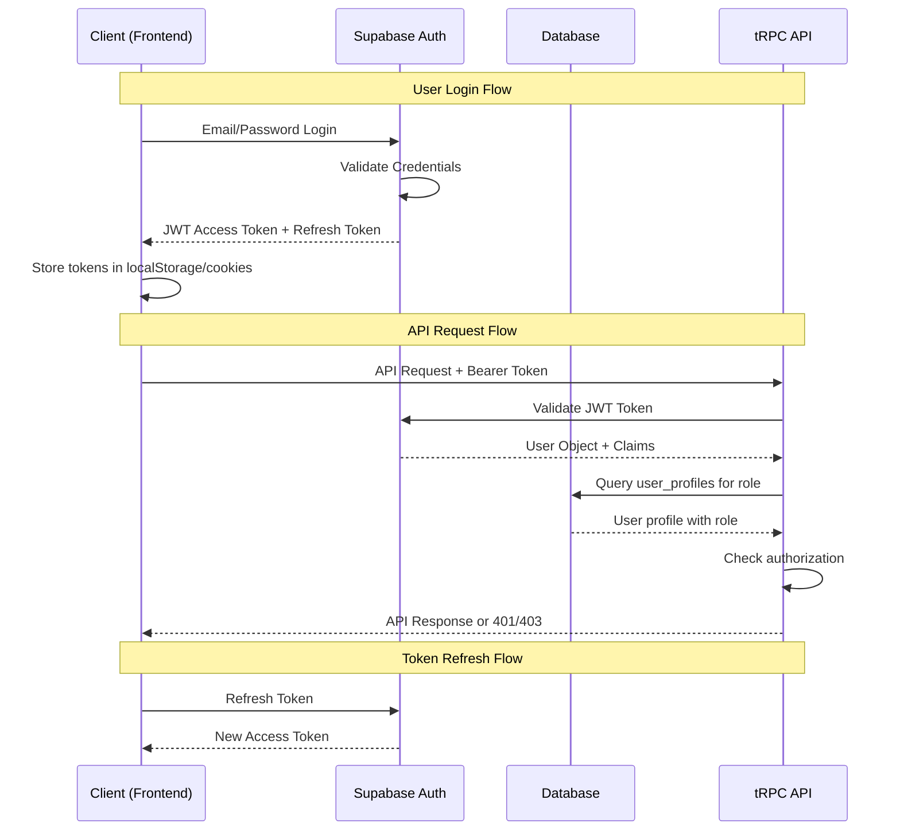
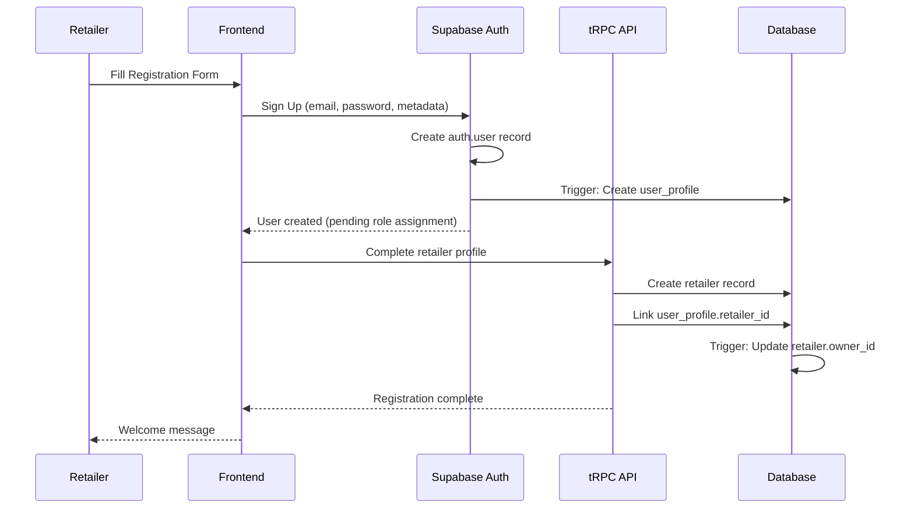
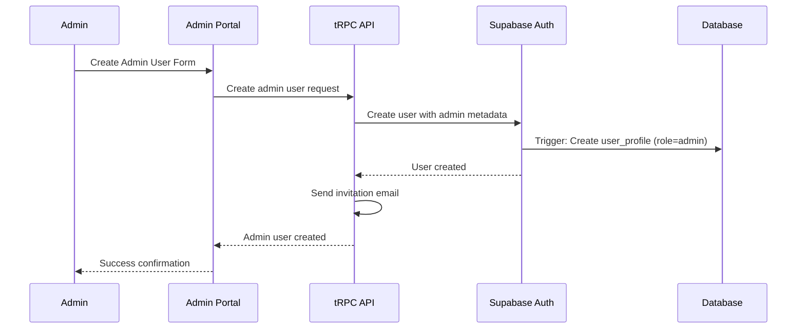

# Authentication Flows Documentation

This document details the authentication and authorization patterns used in the current Livrili system for migration to Python backend.

## Current Authentication Architecture

### Technology Stack
- **Primary Auth**: Supabase Auth (based on GoTrue)
- **Token Type**: JWT (JSON Web Tokens)
- **Session Management**: Supabase SDK with automatic refresh
- **Authorization**: Role-based access control (RBAC)
- **Security**: Row-Level Security (RLS) at database level

### Authentication Flow Overview



## Authentication Components

### 1. Supabase Auth Integration

The system leverages Supabase's built-in authentication service:

```typescript
// Client-side authentication
const supabase = createClient(
  process.env.NEXT_PUBLIC_SUPABASE_URL,
  process.env.NEXT_PUBLIC_SUPABASE_ANON_KEY
)

// Login
const { data, error } = await supabase.auth.signInWithPassword({
  email: 'user@example.com',
  password: 'password'
})

// Get current user
const { data: { user } } = await supabase.auth.getUser()
```

### 2. tRPC Context Creation

Authentication context is created for each API request:

```typescript
export const createAppContext = async (opts: FetchCreateContextFnOptions) => {
  const { req } = opts
  
  // Extract JWT token from Authorization header or cookies
  const authHeader = req.headers.get('authorization')
  const token = authHeader?.replace('Bearer ', '')
  
  let session: Session | null = null
  
  if (token) {
    // Validate token with Supabase
    const { data: { user }, error } = await supabase.auth.getUser(token)
    
    if (!error && user) {
      // Fetch additional user profile data
      const { data: userData } = await supabase
        .from('user_profiles')
        .select('retailer_id, is_active, role')
        .eq('id', user.id)
        .single()
      
      // Create session object
      session = {
        access_token: token,
        user: {
          ...user,
          user_metadata: {
            ...user.user_metadata,
            role: userData?.role,
            retailer_id: userData?.retailer_id,
          }
        }
      }
    }
  }
  
  return {
    session,
    supabase,
    adminSupabase: createAdminSupabaseClient(),
    user: session?.user,
    retailerId: userData?.retailer_id,
  }
}
```

## Authorization Middleware

### 1. Base Authentication Middleware

```typescript
const enforceUserIsAuthed = t.middleware(({ ctx, next }) => {
  if (!ctx.session || !ctx.session.user) {
    throw new TRPCError({ 
      code: 'UNAUTHORIZED', 
      message: 'Authentication required' 
    })
  }
  
  return next({
    ctx: {
      session: { ...ctx.session, user: ctx.session.user },
      user: ctx.session.user,
    },
  })
})

export const protectedProcedure = t.procedure.use(enforceUserIsAuthed)
```

### 2. Admin Authorization Middleware

```typescript
const enforceUserIsAdmin = t.middleware(async ({ ctx, next }) => {
  if (!ctx.session?.user) {
    throw new TRPCError({ code: 'UNAUTHORIZED' })
  }
  
  // Fetch user role from database
  const { data: userData, error } = await ctx.supabase
    .from('users')
    .select('role, is_active')
    .eq('id', ctx.session.user.id)
    .single()
  
  if (error || !userData) {
    throw new TRPCError({ 
      code: 'INTERNAL_SERVER_ERROR', 
      message: 'Failed to verify user permissions' 
    })
  }
  
  if (!userData.is_active) {
    throw new TRPCError({ 
      code: 'FORBIDDEN', 
      message: 'User account is inactive' 
    })
  }
  
  if (userData.role !== 'admin') {
    throw new TRPCError({ 
      code: 'FORBIDDEN', 
      message: 'Admin access required' 
    })
  }
  
  return next({
    ctx: {
      session: ctx.session,
      user: ctx.session.user,
      userRole: userData.role,
    },
  })
})

export const adminProcedure = t.procedure.use(enforceUserIsAdmin)
```

### 3. Retailer Authorization Middleware

```typescript
const enforceUserIsRetailer = t.middleware(async ({ ctx, next }) => {
  if (!ctx.session?.user) {
    throw new TRPCError({ code: 'UNAUTHORIZED' })
  }
  
  // Handle mock authentication for development
  if (ctx.session.user.id === 'mock-user-id' && process.env.NODE_ENV === 'development') {
    return next({
      ctx: {
        session: ctx.session,
        user: ctx.session.user,
        userRole: 'retailer',
        retailerId: 'mock-retailer-id',
      },
    })
  }
  
  // Get user's retailer association
  const { data: userData, error } = await ctx.supabase
    .from('users')
    .select('role, retailer_id')
    .eq('id', ctx.session.user.id)
    .single()
  
  if (error || !userData?.retailer_id) {
    throw new TRPCError({ 
      code: 'FORBIDDEN', 
      message: 'No retailer account associated with user' 
    })
  }
  
  // Verify retailer is active
  const { data: retailerData, error: retailerError } = await ctx.supabase
    .from('retailers')
    .select('id, status')
    .eq('id', userData.retailer_id)
    .single()
  
  if (retailerError || !retailerData || retailerData.status !== 'active') {
    throw new TRPCError({ 
      code: 'FORBIDDEN', 
      message: 'Retailer account is not active' 
    })
  }
  
  return next({
    ctx: {
      session: ctx.session,
      user: ctx.session.user,
      userRole: 'retailer',
      retailerId: userData.retailer_id,
    },
  })
})

export const retailerProcedure = t.procedure.use(enforceUserIsRetailer)
```

## User Registration Flow

### 1. Retailer Registration



### 2. Admin User Creation



## Session Management

### 1. Token Storage
- **Frontend**: Tokens stored in httpOnly cookies (secure)
- **Mobile**: Secure storage via device keychain/keystore
- **Development**: localStorage for easier debugging

### 2. Token Refresh
- Automatic refresh before token expiration
- Refresh token rotation for enhanced security
- Fallback to login if refresh fails

### 3. Session Persistence
```typescript
// Session restoration on app load
const initializeAuth = async () => {
  const { data: { session } } = await supabase.auth.getSession()
  
  if (session) {
    // Validate session is still valid
    const { data: { user } } = await supabase.auth.getUser()
    
    if (user) {
      // Fetch latest user profile
      const { data: profile } = await supabase
        .from('user_profiles')
        .select('*')
        .eq('id', user.id)
        .single()
      
      // Update application state
      setUser({ ...user, profile })
    }
  }
}
```

## Role-Based Access Control (RBAC)

### User Roles
1. **Admin**: Full system access
   - User management
   - Product catalog management
   - Order processing
   - Analytics and reporting
   - System configuration

2. **Retailer**: Business user access
   - Product browsing
   - Cart management
   - Order placement
   - Order history
   - Profile management

3. **Driver**: Delivery personnel access
   - Delivery assignments
   - Route management
   - Delivery confirmation
   - Performance tracking

### Permission Matrix

| Resource | Admin | Retailer | Driver |
|----------|-------|----------|--------|
| Users | CRUD | Read (self) | Read (self) |
| Retailers | CRUD | Read (own) | None |
| Products | CRUD | Read | None |
| Categories | CRUD | Read | None |
| Orders | CRUD | Read (own) | Read (assigned) |
| Cart | Read All | CRUD (own) | None |
| Analytics | Read | None | None |
| Deliveries | CRUD | Read (own) | CRUD (assigned) |

## Security Features

### 1. Row-Level Security (RLS)
Database-level access control that works with Supabase Auth:

```sql
-- Users can only see their own profile
CREATE POLICY user_profiles_policy ON user_profiles
  FOR ALL USING (
    auth.uid() = id OR 
    EXISTS (
      SELECT 1 FROM user_profiles 
      WHERE id = auth.uid() AND role = 'admin'
    )
  );

-- Users can only access their own cart items
CREATE POLICY shopping_carts_policy ON shopping_carts
  FOR ALL USING (user_id = auth.uid());
```

### 2. Input Validation
- Zod schemas for all API inputs
- SQL injection prevention via parameterized queries
- XSS protection through data sanitization

### 3. Rate Limiting
- API endpoint rate limiting (not fully implemented)
- Login attempt throttling via Supabase

### 4. Audit Logging
- All sensitive operations logged
- User actions tracked with IP and user agent
- Change history for critical data

## Mock Authentication (Development)

For development and testing, the system supports mock authentication:

```typescript
// Mock token for development
if (token === 'mock-token' && process.env.NODE_ENV === 'development') {
  session = {
    access_token: token,
    user: {
      id: 'mock-user-id',
      email: 'mock@example.com',
      user_metadata: {
        role: 'retailer',
        retailer_id: 'mock-retailer-id',
      }
    }
  }
}
```

## Migration Considerations for Python

### 1. JWT Token Validation
- Replace Supabase JWT validation with PyJWT or similar
- Implement public key validation for JWT signatures
- Handle token expiration and refresh logic

### 2. User Context Creation
- Recreate user context middleware in Python web framework
- Implement user profile caching for performance
- Handle retailer association logic

### 3. Authorization Decorators
```python
# Example Python decorator equivalent
def require_admin(func):
    @wraps(func)
    def wrapper(request, *args, **kwargs):
        user = get_current_user(request)
        if not user or user.role != 'admin' or not user.is_active:
            raise PermissionDenied()
        return func(request, *args, **kwargs)
    return wrapper
```

### 4. Database Authorization
- Replace RLS policies with application-level authorization
- Implement query filtering based on user permissions
- Maintain same authorization logic and business rules

### 5. Session Management
- Implement secure session storage
- Handle token refresh and expiration
- Maintain session persistence across requests

---

*This authentication system provides robust security with role-based access control. The migration to Python should preserve these security patterns while adapting to the new framework's authentication mechanisms.*