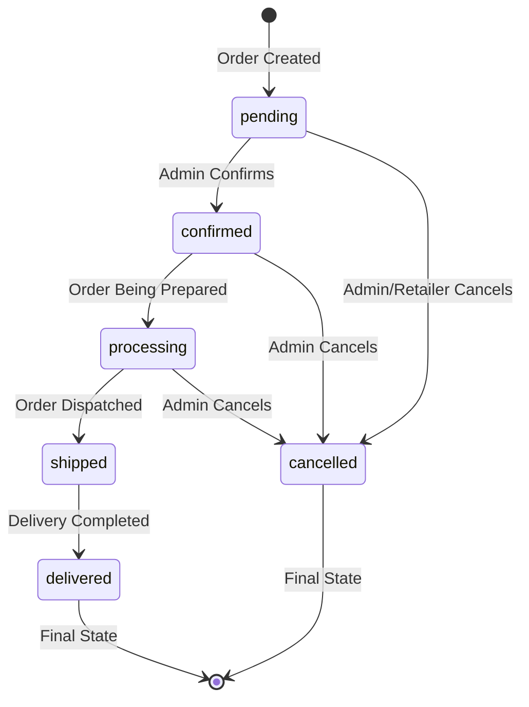
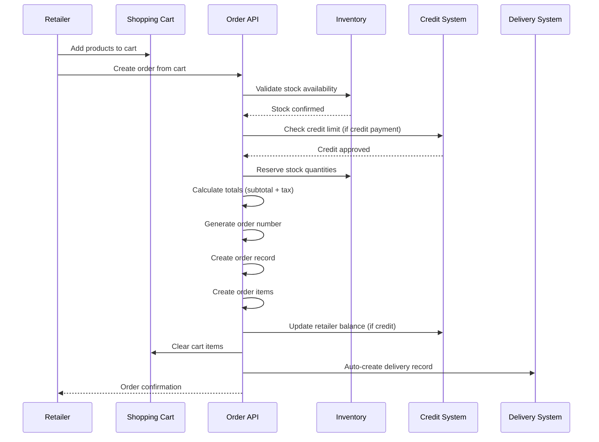
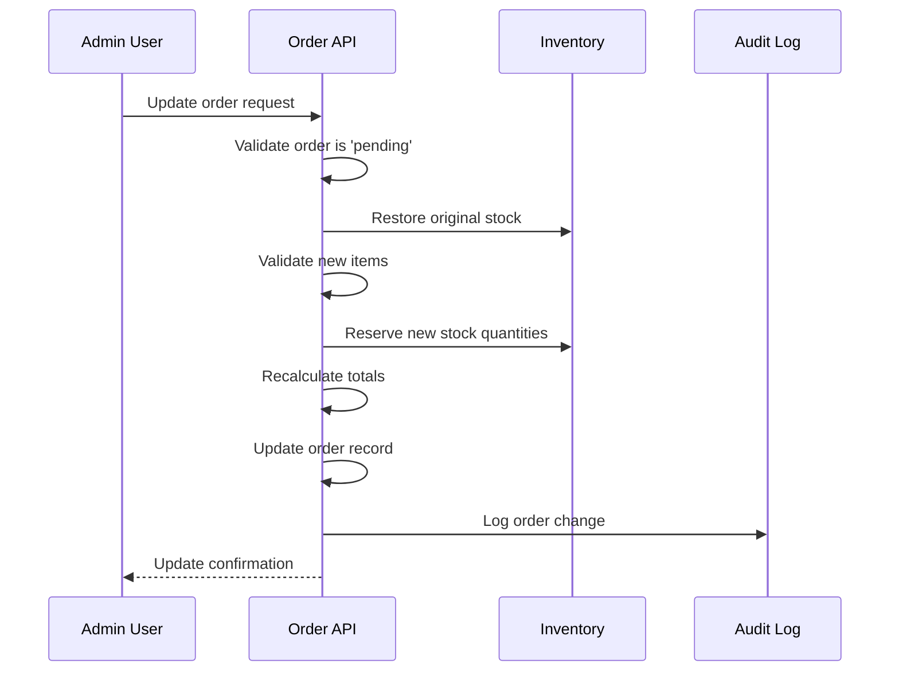
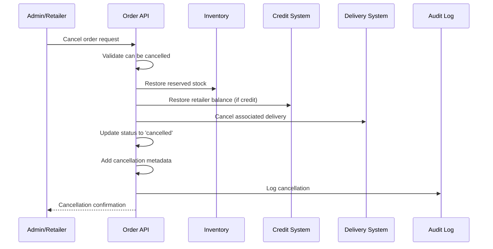
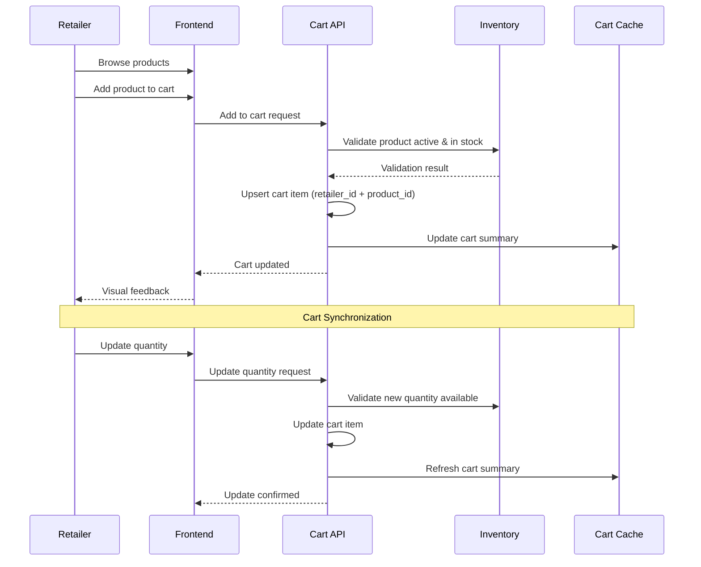
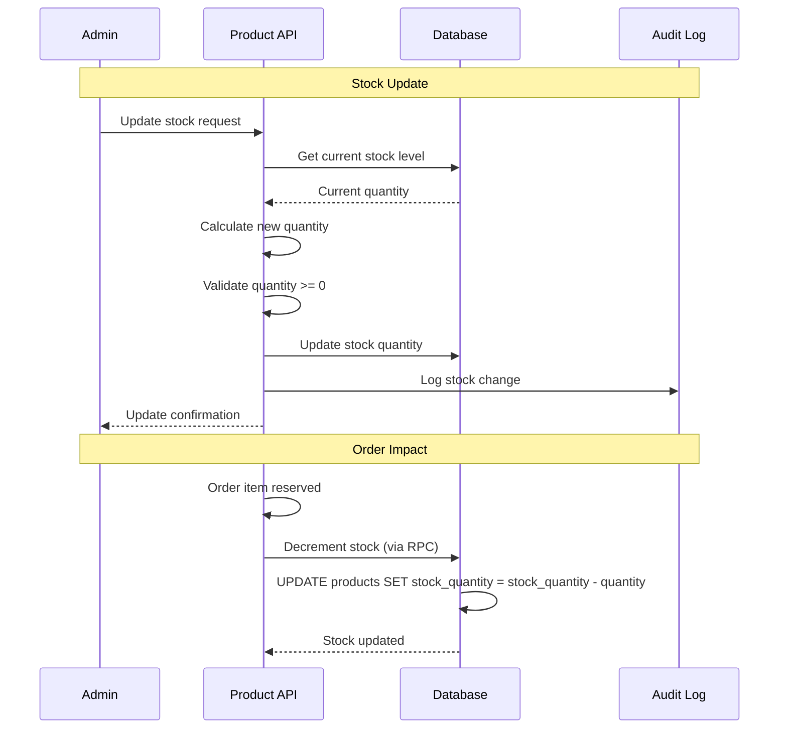
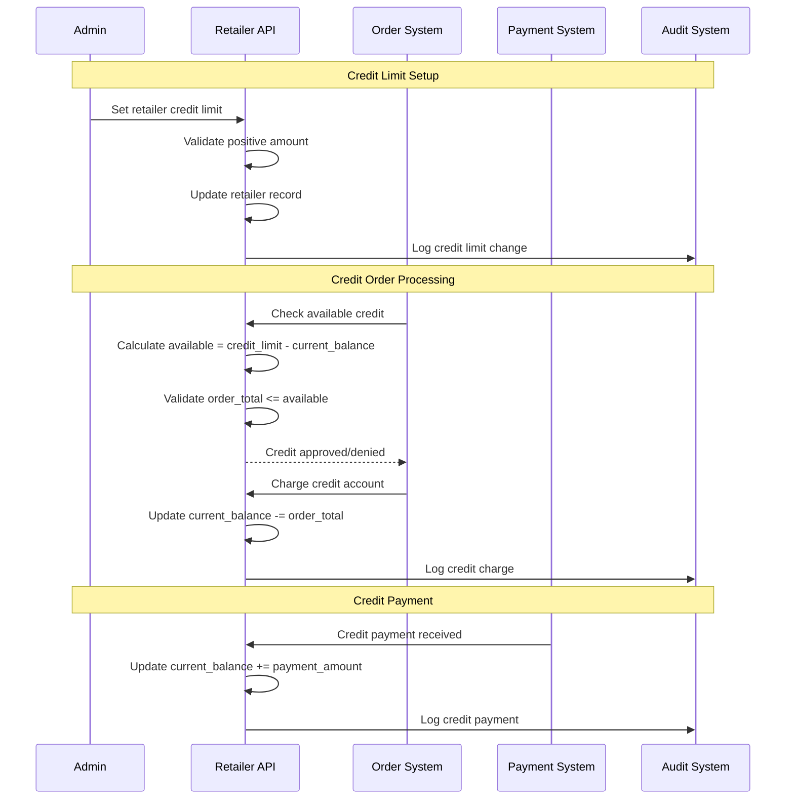
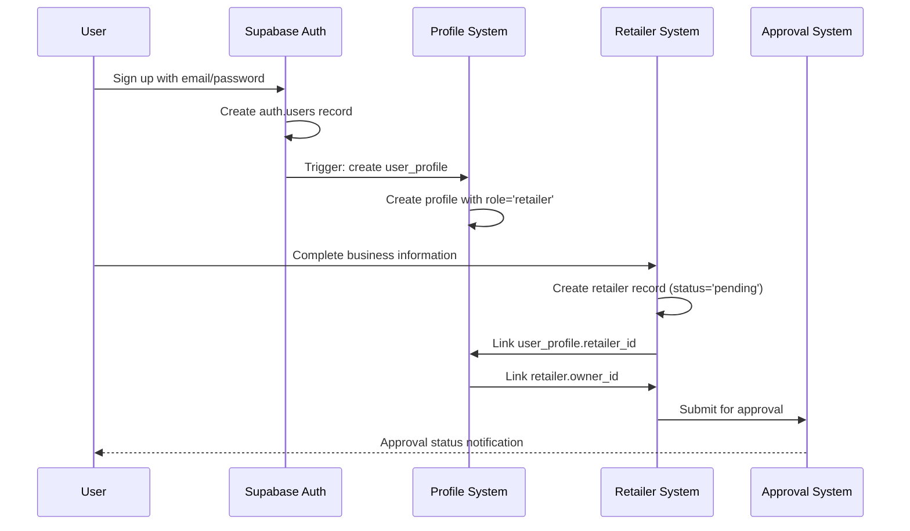
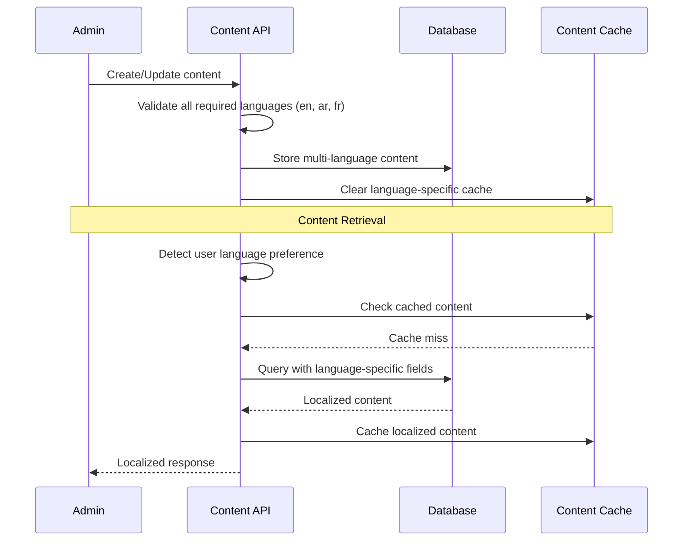

# Core Business Workflows

This document details the key business processes and workflows implemented in the Livrili system, essential for maintaining business logic consistency during migration.

## 1. Order Processing Workflow

### Order Lifecycle States



### Order Creation Process



### Business Rules

#### Order Creation Validation
1. **Retailer Status**: Must be 'active' to place orders
2. **Product Availability**: All products must be active and in stock
3. **Stock Reservation**: Quantities reserved immediately on order creation
4. **Credit Validation**: Credit orders checked against available credit limit
5. **Minimum Quantities**: Respect product minimum order quantities

#### Financial Calculations
```typescript
// Order totals calculation
const calculateOrderTotals = (items: OrderItem[]) => {
  let subtotal = 0
  let taxAmount = 0
  
  items.forEach(item => {
    const lineSubtotal = item.quantity * item.unit_price
    const lineTax = lineSubtotal * (item.tax_rate / 100)
    
    subtotal += lineSubtotal
    taxAmount += lineTax
  })
  
  const totalAmount = subtotal + taxAmount
  
  return { subtotal, taxAmount, totalAmount }
}
```

#### Status Transition Rules
```typescript
const validTransitions: Record<string, string[]> = {
  pending: ['confirmed', 'cancelled'],
  confirmed: ['processing', 'cancelled'],
  processing: ['shipped', 'cancelled'],
  shipped: ['delivered'],
  delivered: [], // Final state
  cancelled: [], // Final state
}
```

### Order Update Process



### Order Cancellation Process



## 2. Cart Management Workflow

### Cart Operations



### Cart Summary Calculation

The system uses a database function for efficient cart summary calculation:

```sql
CREATE OR REPLACE FUNCTION get_cart_summary(p_retailer_id UUID)
RETURNS TABLE (
  total_items BIGINT,
  subtotal DECIMAL(10,2),
  tax_amount DECIMAL(10,2),
  total_amount DECIMAL(10,2)
) AS $$
BEGIN
  RETURN QUERY
  SELECT 
    COALESCE(SUM(sc.quantity), 0) as total_items,
    COALESCE(SUM(sc.quantity * p.base_price), 0) as subtotal,
    COALESCE(SUM(sc.quantity * p.base_price * p.tax_rate / 100), 0) as tax_amount,
    COALESCE(SUM(sc.quantity * p.base_price * (1 + p.tax_rate / 100)), 0) as total_amount
  FROM shopping_carts sc
  JOIN products p ON sc.product_id = p.id
  WHERE sc.retailer_id = p_retailer_id
    AND p.is_active = true;
END;
$$ LANGUAGE plpgsql;
```

### Offline Cart Synchronization

The system supports offline cart operations with synchronization:

```typescript
interface OfflineAction {
  actionType: 'add_to_cart' | 'remove_from_cart' | 'update_quantity' | 'clear_cart'
  payload: {
    productId?: string
    quantity?: number
  }
  deviceId?: string
  timestamp: string
}

// Sync offline actions when connection restored
const syncOfflineActions = async (actions: OfflineAction[]) => {
  const results = []
  
  for (const action of actions) {
    try {
      // Log to offline sync queue
      await logOfflineAction(action)
      
      // Execute the action
      await executeCartAction(action)
      
      // Mark as synced
      await markActionSynced(action)
      
      results.push({ ...action, success: true })
    } catch (error) {
      await markActionFailed(action, error)
      results.push({ ...action, success: false, error })
    }
  }
  
  return results
}
```

## 3. Inventory Management Workflow

### Stock Operations



### Stock Management Functions

The system uses PostgreSQL functions for atomic stock operations:

```sql
-- Decrement stock atomically
CREATE OR REPLACE FUNCTION decrement_stock(product_id UUID, quantity INTEGER)
RETURNS VOID AS $$
BEGIN
  UPDATE products 
  SET stock_quantity = stock_quantity - quantity
  WHERE id = product_id;
  
  -- Prevent negative stock
  IF (SELECT stock_quantity FROM products WHERE id = product_id) < 0 THEN
    RAISE EXCEPTION 'Insufficient stock for product %', product_id;
  END IF;
END;
$$ LANGUAGE plpgsql;

-- Increment stock atomically  
CREATE OR REPLACE FUNCTION increment_stock(product_id UUID, quantity INTEGER)
RETURNS VOID AS $$
BEGIN
  UPDATE products 
  SET stock_quantity = stock_quantity + quantity
  WHERE id = product_id;
END;
$$ LANGUAGE plpgsql;
```

### Stock Validation Rules

1. **Non-Negative Stock**: Stock quantities cannot go below zero
2. **Atomic Operations**: Stock changes are atomic to prevent race conditions
3. **Order Reservation**: Stock reserved immediately when order created
4. **Cancellation Recovery**: Stock restored when orders cancelled
5. **Update Validation**: Stock updates validate business rules

## 4. Retailer Credit Management Workflow

### Credit System Operations



### Credit Calculation Logic

```typescript
interface RetailerCredit {
  credit_limit: number
  current_balance: number
}

const calculateAvailableCredit = (retailer: RetailerCredit): number => {
  // Available credit = limit - current balance
  // Negative balance means they owe money
  return retailer.credit_limit - Math.abs(retailer.current_balance)
}

const canPlaceCreditOrder = (retailer: RetailerCredit, orderTotal: number): boolean => {
  const availableCredit = calculateAvailableCredit(retailer)
  return availableCredit >= orderTotal
}
```

## 5. User Profile Management Workflow

### Retailer Registration Process



### Profile Update Triggers

```sql
-- Auto-link user to retailer when retailer_id is set
CREATE OR REPLACE FUNCTION link_user_to_retailer()
RETURNS TRIGGER AS $$
BEGIN
  IF NEW.retailer_id IS NOT NULL AND OLD.retailer_id IS DISTINCT FROM NEW.retailer_id THEN
    UPDATE retailers 
    SET owner_id = NEW.id 
    WHERE id = NEW.retailer_id;
  END IF;
  RETURN NEW;
END;
$$ LANGUAGE plpgsql SECURITY DEFINER;
```

## 6. Multi-Language Content Management

### Language Support Workflow



### Content Validation Rules

```typescript
const validateMultiLanguageContent = (content: MultiLanguageContent) => {
  const requiredLanguages = ['en', 'ar', 'fr']
  const requiredFields = ['name']
  
  for (const lang of requiredLanguages) {
    for (const field of requiredFields) {
      if (!content[`${field}_${lang}`] || content[`${field}_${lang}`].trim() === '') {
        throw new Error(`${field}_${lang} is required`)
      }
    }
  }
}
```

## 7. Audit and Logging Workflow

### Audit Log Creation

```typescript
const createAuditLog = async (
  supabase: SupabaseClient,
  userId: string,
  action: string,
  resourceId: string,
  oldValues?: any,
  newValues?: any
) => {
  await supabase.from('audit_logs').insert({
    user_id: userId,
    action,
    resource_type: 'order', // or other resource type
    resource_id: resourceId,
    old_values: oldValues || null,
    new_values: newValues || null,
    ip_address: getClientIP(),
    user_agent: getUserAgent(),
    created_at: new Date().toISOString()
  })
}
```

### Audit Events

1. **Order Events**: created, updated, status_changed, cancelled
2. **Product Events**: created, updated, deleted, stock_updated
3. **User Events**: created, updated, role_changed, activated, deactivated
4. **Retailer Events**: created, approved, suspended, credit_updated
5. **System Events**: login, logout, permission_denied, error

## Migration Considerations

### Business Logic Preservation

1. **State Machines**: Order status transitions must be preserved
2. **Financial Calculations**: Decimal precision for monetary amounts
3. **Stock Management**: Atomic operations for inventory updates
4. **Credit System**: Credit limit and balance calculations
5. **Multi-Language**: Content validation and retrieval patterns
6. **Audit Trail**: Comprehensive logging for compliance

### Python Implementation Notes

1. **Use Enums**: Python enums for status values and roles
2. **Decimal Types**: Python Decimal for financial calculations
3. **Database Transactions**: Ensure atomic operations
4. **Validation**: Pydantic models for input validation
5. **State Machines**: Consider django-fsm or similar for order states
6. **Async Operations**: Background tasks for email/notifications
7. **Caching**: Redis for cart summaries and session data

---

*These workflows represent the core business logic that must be preserved during the migration to Python. Each workflow includes validation rules, state management, and business constraints that are critical for the platform's operation.*