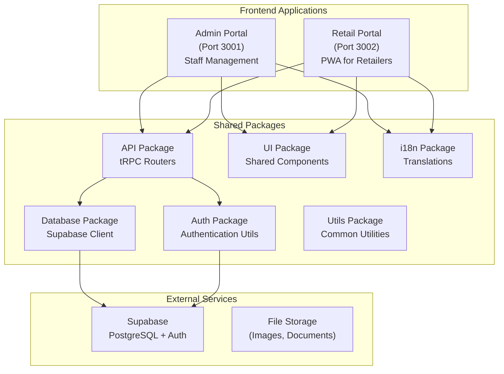
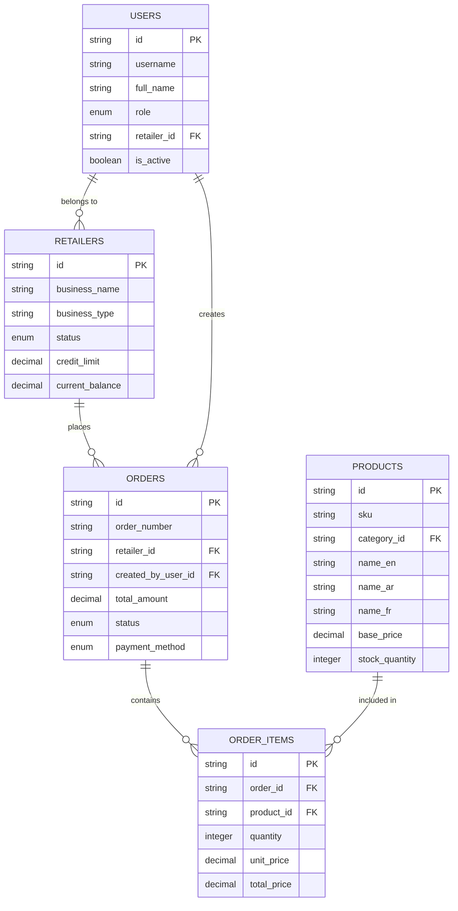
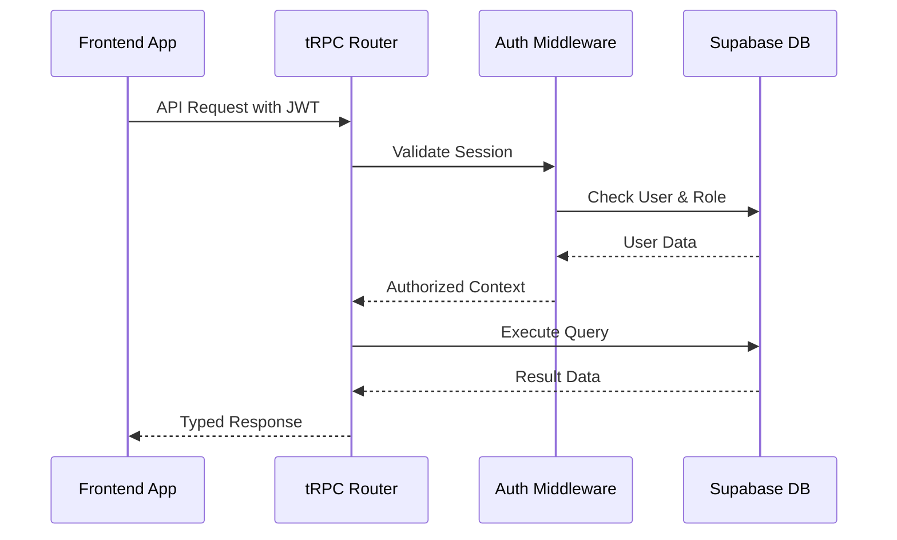

# System Overview - Current Architecture

## High-Level Architecture

Livrili is a B2B e-commerce platform built as a monorepo using Turborepo, designed for the Algerian market with multi-language support (Arabic, French, English).

## Core Components

### 1. Applications

#### Admin Portal (`apps/admin-portal`)
- **Purpose**: Internal management system for Livrili staff
- **Port**: 3001
- **Technology**: Next.js 15 with App Router
- **Key Features**:
  - User management (admin staff, retailers, drivers)
  - Product catalog management
  - Order processing and tracking
  - Analytics and reporting
  - Delivery management
  - Payment processing

#### Retail Portal (`apps/retail-portal`)  
- **Purpose**: PWA for retailers to place orders
- **Port**: 3002
- **Technology**: Next.js 15 with App Router + PWA capabilities
- **Key Features**:
  - Product browsing and ordering
  - Cart management
  - Order history and tracking
  - Profile management
  - Multi-language support
  - Offline capabilities

### 2. Shared Packages

#### API Package (`packages/api`)
- **Technology**: tRPC v11 with TypeScript
- **Architecture**: Router-based organization
- **Key Routers**:
  - Retailer-specific: `retailer.profile`, `retailer.cart`, `retailer.products`, `retailer.orders`
  - Admin: `users`, `products`, `categories`, `retailers`, `orders`, `analytics`
  - Shared: `communications`, `payments`, `deliveries`, `suppliers`

#### Authentication Package (`packages/auth`)
- **Technology**: Supabase Auth integration
- **Features**:
  - JWT token management
  - Role-based access control
  - Session persistence
  - Password utilities

#### Database Package (`packages/database`)
- **Technology**: Supabase PostgreSQL client
- **Features**:
  - Type-safe database operations
  - Schema definitions
  - Migration utilities

### 3. Data Architecture

#### Core Entities

## Authentication & Authorization

### Authentication Flow
1. **Supabase Auth**: Handles user authentication (email/password)
2. **JWT Tokens**: Issued by Supabase, validated in tRPC middleware
3. **Role-Based Access**: Users assigned roles (admin, retailer, driver)
4. **Session Management**: Persistent sessions with refresh tokens

### Authorization Levels
- **Public Procedures**: No authentication required
- **Protected Procedures**: Requires valid session
- **Admin Procedures**: Requires admin role + active status
- **Retailer Procedures**: Requires retailer role + active retailer account

## Request/Response Flow

## Key Design Patterns

### 1. Monorepo Structure
- **Shared Code**: Common utilities, types, and components
- **Type Safety**: End-to-end TypeScript with tRPC
- **Development Efficiency**: Single repository for all related code

### 2. Multi-Language Support
- **i18n Package**: Centralized translation management  
- **Database Localization**: Multi-language fields (name_en, name_ar, name_fr)
- **Runtime Language Switching**: Dynamic language selection

### 3. Role-Based Architecture
- **Namespaced Routers**: Separate router namespaces for different user roles
- **Middleware Chain**: Progressive authorization checks
- **Context Injection**: User context available throughout request lifecycle

## Performance Characteristics

### Current Performance Profile
- **API Response Time**: 100-500ms typical
- **Database Queries**: Direct PostgreSQL via Supabase
- **Caching**: React Query on frontend, no backend caching
- **Scalability**: Limited by single Supabase instance

### Bottlenecks Identified
1. **N+1 Query Problems**: Some routers lack proper query optimization
2. **No Backend Caching**: All data fetched from database on each request
3. **Complex Joins**: Some queries involve multiple table joins
4. **File Storage**: Images and documents stored in Supabase storage

## Security Model

### Current Security Measures
- **Row-Level Security**: Database-level access control
- **JWT Validation**: Token-based authentication
- **Input Validation**: Zod schemas for all inputs
- **Environment Variables**: Sensitive configuration externalized

### Security Considerations for Migration
- **API Keys**: Supabase service role keys need secure handling
- **CORS**: Proper cross-origin configuration required
- **Rate Limiting**: Currently minimal rate limiting
- **Data Encryption**: Sensitive data encryption at rest and in transit

## Integration Points

### External Dependencies
- **Supabase**: Database, authentication, and file storage
- **Email Services**: User communications (via Supabase)
- **Payment Processing**: Integration points for payment gateways
- **Mapping Services**: Delivery address validation and routing

### Internal Communication
- **tRPC**: Type-safe API communication
- **React Query**: Frontend state management and caching  
- **Shared Types**: TypeScript interfaces shared across packages
- **Event System**: Limited real-time features via Supabase realtime

---

*This document provides the foundational understanding needed for migrating to a Python-based backend while preserving the existing functionality and improving upon current limitations.*