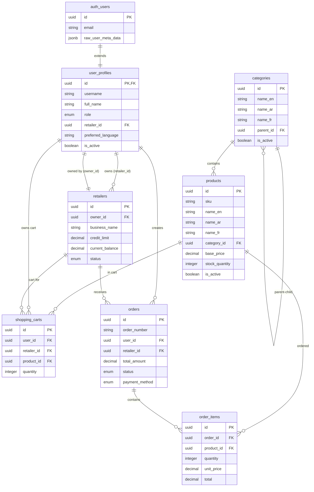

# Database Schema Documentation

This document provides comprehensive analysis of the Livrili PostgreSQL database schema, including tables, relationships, constraints, and business rules.

## Schema Overview

The database is built on PostgreSQL with Supabase extensions and follows these design principles:
- **Supabase Auth Integration**: Leverages `auth.users` for authentication
- **Multi-language Support**: Supports English, Arabic, and French
- **Row-Level Security**: Comprehensive RLS policies for data access control
- **UUID Primary Keys**: All tables use UUID for primary keys
- **Audit Trails**: Automatic `created_at` and `updated_at` timestamps
- **Referential Integrity**: Foreign key constraints maintain data consistency

## Core Entity Tables

### 1. User Profiles (`user_profiles`)

Extends Supabase `auth.users` with application-specific data.

```sql
CREATE TABLE user_profiles (
    id UUID PRIMARY KEY REFERENCES auth.users(id) ON DELETE CASCADE,
    username VARCHAR(100) UNIQUE,
    full_name VARCHAR(255),
    role VARCHAR(50) NOT NULL CHECK (role IN ('admin', 'retailer', 'driver')),
    retailer_id UUID,
    preferred_language VARCHAR(10) DEFAULT 'ar' CHECK (preferred_language IN ('en', 'ar', 'fr')),
    is_active BOOLEAN DEFAULT true,
    created_at TIMESTAMP WITH TIME ZONE DEFAULT CURRENT_TIMESTAMP,
    updated_at TIMESTAMP WITH TIME ZONE DEFAULT CURRENT_TIMESTAMP
);
```

**Business Rules**:
- Automatically created via trigger when user signs up in Supabase Auth
- Role determines access permissions throughout application
- `retailer_id` links retailer users to their business account
- Multi-language preference affects UI and content display

**Indexes**:
- `idx_user_profiles_retailer_id` on `retailer_id`
- `idx_user_profiles_username` on `username`

### 2. Retailers (`retailers`)

Business accounts for retailers who place orders.

```sql
CREATE TABLE retailers (
    id UUID PRIMARY KEY DEFAULT uuid_generate_v4(),
    owner_id UUID REFERENCES auth.users(id) ON DELETE SET NULL,
    business_name VARCHAR(255) NOT NULL,
    business_type VARCHAR(100),
    registration_number VARCHAR(100),
    tax_number VARCHAR(100),
    phone VARCHAR(50),
    email VARCHAR(255),
    address TEXT,
    city VARCHAR(100),
    state VARCHAR(100),
    postal_code VARCHAR(20),
    credit_limit DECIMAL(10, 2) DEFAULT 0,
    current_balance DECIMAL(10, 2) DEFAULT 0,
    status VARCHAR(50) DEFAULT 'pending' CHECK (status IN ('pending', 'active', 'suspended', 'inactive')),
    created_at TIMESTAMP WITH TIME ZONE DEFAULT CURRENT_TIMESTAMP,
    updated_at TIMESTAMP WITH TIME ZONE DEFAULT CURRENT_TIMESTAMP
);
```

**Business Rules**:
- Status controls retailer's ability to place orders
- Credit system: `credit_limit` - `current_balance` = available credit
- Business registration and tax details for compliance
- `owner_id` links to the primary user account for the business

**Indexes**:
- `idx_retailers_owner_id` on `owner_id`

### 3. Categories (`categories`)

Hierarchical product categorization with multi-language support.

```sql
CREATE TABLE categories (
    id UUID PRIMARY KEY DEFAULT uuid_generate_v4(),
    name_en VARCHAR(255) NOT NULL,
    name_ar VARCHAR(255) NOT NULL,
    name_fr VARCHAR(255) NOT NULL,
    description_en TEXT,
    description_ar TEXT,
    description_fr TEXT,
    icon VARCHAR(100),
    parent_id UUID REFERENCES categories(id),
    sort_order INTEGER DEFAULT 0,
    is_active BOOLEAN DEFAULT true,
    created_at TIMESTAMP WITH TIME ZONE DEFAULT CURRENT_TIMESTAMP,
    updated_at TIMESTAMP WITH TIME ZONE DEFAULT CURRENT_TIMESTAMP
);
```

**Business Rules**:
- Self-referencing hierarchy via `parent_id`
- Multi-language names required for all three supported languages
- `sort_order` controls display sequence
- `is_active` allows hiding categories without deletion

### 4. Products (`products`)

Product catalog with multi-language content and inventory tracking.

```sql
CREATE TABLE products (
    id UUID PRIMARY KEY DEFAULT uuid_generate_v4(),
    sku VARCHAR(100) UNIQUE NOT NULL,
    name_en VARCHAR(255) NOT NULL,
    name_ar VARCHAR(255) NOT NULL,
    name_fr VARCHAR(255) NOT NULL,
    description_en TEXT,
    description_ar TEXT,
    description_fr TEXT,
    category_id UUID REFERENCES categories(id),
    base_price DECIMAL(10, 2) NOT NULL,
    tax_rate DECIMAL(5, 2) DEFAULT 19,
    stock_quantity INTEGER DEFAULT 0,
    min_order_quantity INTEGER DEFAULT 1,
    images JSONB DEFAULT '[]'::jsonb,
    is_active BOOLEAN DEFAULT true,
    created_at TIMESTAMP WITH TIME ZONE DEFAULT CURRENT_TIMESTAMP,
    updated_at TIMESTAMP WITH TIME ZONE DEFAULT CURRENT_TIMESTAMP
);
```

**Business Rules**:
- SKU uniqueness enforced for inventory management
- Multi-language content for all supported languages
- Price in decimal format for financial accuracy
- Tax rate as percentage (default 19% VAT)
- Stock quantity tracking for inventory management
- Images stored as JSON array of URLs
- Category association for organization

**Indexes**:
- `idx_products_category_id` on `category_id`
- `idx_products_sku` on `sku` (unique constraint)

## Transaction Tables

### 5. Shopping Carts (`shopping_carts`)

Temporary storage for retailer product selections.

```sql
CREATE TABLE shopping_carts (
    id UUID PRIMARY KEY DEFAULT uuid_generate_v4(),
    user_id UUID NOT NULL REFERENCES auth.users(id) ON DELETE CASCADE,
    retailer_id UUID NOT NULL REFERENCES retailers(id) ON DELETE CASCADE,
    product_id UUID NOT NULL REFERENCES products(id),
    quantity INTEGER NOT NULL DEFAULT 1 CHECK (quantity > 0),
    added_at TIMESTAMP WITH TIME ZONE DEFAULT CURRENT_TIMESTAMP,
    updated_at TIMESTAMP WITH TIME ZONE DEFAULT CURRENT_TIMESTAMP,
    UNIQUE(user_id, product_id)
);
```

**Business Rules**:
- One cart item per user-product combination
- Quantity must be positive
- Cascades delete when user or retailer is deleted
- Tracks when items were added/modified

**Indexes**:
- `idx_shopping_carts_user_id` on `user_id`
- `idx_shopping_carts_retailer_id` on `retailer_id`

### 6. Orders (`orders`)

Order header containing delivery and payment information.

```sql
CREATE TABLE orders (
    id UUID PRIMARY KEY DEFAULT uuid_generate_v4(),
    order_number VARCHAR(50) UNIQUE NOT NULL,
    user_id UUID NOT NULL REFERENCES auth.users(id),
    retailer_id UUID NOT NULL REFERENCES retailers(id),
    subtotal_amount DECIMAL(10, 2) NOT NULL,
    tax_amount DECIMAL(10, 2) NOT NULL,
    total_amount DECIMAL(10, 2) NOT NULL,
    status VARCHAR(50) NOT NULL DEFAULT 'pending' CHECK (status IN ('pending', 'processing', 'shipped', 'delivered', 'cancelled')),
    payment_method VARCHAR(50) DEFAULT 'cash' CHECK (payment_method IN ('cash', 'credit')),
    delivery_date DATE,
    notes TEXT,
    created_at TIMESTAMP WITH TIME ZONE DEFAULT CURRENT_TIMESTAMP,
    updated_at TIMESTAMP WITH TIME ZONE DEFAULT CURRENT_TIMESTAMP
);
```

**Business Rules**:
- Order lifecycle: `pending` → `processing` → `shipped` → `delivered`
- Can be `cancelled` at any stage before delivery
- Financial amounts separated: subtotal, tax, total
- Payment methods: cash on delivery or credit account
- Order number for human-readable identification

**Indexes**:
- `idx_orders_user_id` on `user_id`
- `idx_orders_retailer_id` on `retailer_id`
- `idx_orders_status` on `status` (for filtering)

### 7. Order Items (`order_items`)

Line items for each order with pricing details.

```sql
CREATE TABLE order_items (
    id UUID PRIMARY KEY DEFAULT uuid_generate_v4(),
    order_id UUID NOT NULL REFERENCES orders(id) ON DELETE CASCADE,
    product_id UUID NOT NULL REFERENCES products(id),
    quantity INTEGER NOT NULL CHECK (quantity > 0),
    unit_price DECIMAL(10, 2) NOT NULL,
    tax_rate DECIMAL(5, 2) DEFAULT 19,
    subtotal DECIMAL(10, 2) NOT NULL,
    tax_amount DECIMAL(10, 2) NOT NULL,
    total DECIMAL(10, 2) NOT NULL,
    created_at TIMESTAMP WITH TIME ZONE DEFAULT CURRENT_TIMESTAMP
);
```

**Business Rules**:
- Cascades delete when order is deleted
- Captures pricing at time of order (not current product price)
- Financial calculations: `subtotal + tax_amount = total`
- Immutable once created (no updates allowed)

**Indexes**:
- `idx_order_items_order_id` on `order_id`

## Database Functions & Triggers

### Automatic Timestamp Updates

```sql
CREATE OR REPLACE FUNCTION update_updated_at_column()
RETURNS TRIGGER AS $$
BEGIN
    NEW.updated_at = CURRENT_TIMESTAMP;
    RETURN NEW;
END;
$$ language 'plpgsql';
```

Applied to all tables with `updated_at` columns.

### User Profile Creation

```sql
CREATE OR REPLACE FUNCTION handle_new_user()
RETURNS TRIGGER AS $$
BEGIN
  INSERT INTO user_profiles (id, full_name, role)
  VALUES (
    NEW.id,
    COALESCE(NEW.raw_user_meta_data->>'full_name', ''),
    COALESCE(NEW.raw_user_meta_data->>'role', 'retailer')
  );
  RETURN NEW;
END;
$$ LANGUAGE plpgsql SECURITY DEFINER;
```

Automatically creates user profile when user signs up in Supabase Auth.

### Retailer Linking

```sql
CREATE OR REPLACE FUNCTION link_user_to_retailer()
RETURNS TRIGGER AS $$
BEGIN
  IF NEW.retailer_id IS NOT NULL AND OLD.retailer_id IS DISTINCT FROM NEW.retailer_id THEN
    UPDATE retailers 
    SET owner_id = NEW.id 
    WHERE id = NEW.retailer_id;
  END IF;
  RETURN NEW;
END;
$$ LANGUAGE plpgsql SECURITY DEFINER;
```

Maintains bidirectional relationship between users and retailers.

## Row-Level Security (RLS) Policies

All tables have RLS enabled with the following access patterns:

### User Profiles
- Users can access their own profile
- Admins can access all profiles

### Retailers  
- Business owners can access their retailer record
- Associated users can access their retailer's data
- Admins can access all retailers

### Products & Categories
- Read access for all authenticated users
- Write access only for admins

### Shopping Carts
- Users can only access their own cart items

### Orders & Order Items
- Users can access their own orders
- Admins can access all orders

## Entity Relationships



## Data Types and Constraints

### Financial Data
- All monetary amounts use `DECIMAL(10, 2)` for precision
- Tax rates use `DECIMAL(5, 2)` for percentage values
- Prevents floating-point arithmetic errors in financial calculations

### Multi-language Support
- Required fields: `name_en`, `name_ar`, `name_fr`
- Optional descriptions in all three languages
- Language preference stored per user

### Status Enumerations
- **User Roles**: `admin`, `retailer`, `driver`
- **Retailer Status**: `pending`, `active`, `suspended`, `inactive`
- **Order Status**: `pending`, `processing`, `shipped`, `delivered`, `cancelled`
- **Payment Methods**: `cash`, `credit`
- **Languages**: `en`, `ar`, `fr`

### Validation Constraints
- Positive quantities enforced via CHECK constraints
- Email format validation in user profiles
- UUID format validation for foreign keys
- Enum constraints for status fields

## Performance Considerations

### Indexes
Strategic indexes on:
- Foreign key columns for join performance
- Status columns for filtering
- Username for unique lookups
- SKU for product searches

### Query Optimization
- Use UUID indexes for primary key lookups
- Category hierarchy queries may need recursive CTEs
- Order status filtering benefits from partial indexes
- Multi-language searches require careful indexing

### Scaling Considerations
- Shopping carts may need archiving for inactive users
- Order history grows indefinitely - consider partitioning
- Product images stored as JSON - consider separate media service
- Category hierarchy depth should be limited for performance

## Migration Notes

### Key Schema Features for Python Migration
1. **UUID Type**: Ensure Python ORM handles UUID properly
2. **JSONB Fields**: Map to appropriate Python data structures
3. **Enum Constraints**: Implement as Python enums or choices
4. **Decimal Precision**: Use appropriate decimal types for financial data
5. **Timezone Handling**: All timestamps are timezone-aware
6. **Multi-language**: Plan for i18n/l10n in Python models

### RLS Policy Migration
- RLS policies encode complex business logic
- May be replaced with application-level authorization
- Policies reference auth.uid() - adapt for new auth system
- Admin role checks need equivalent in Python authorization

### Trigger Migration  
- Automatic timestamp updates can use ORM hooks
- User profile creation needs equivalent in Python
- Business logic in triggers should move to application layer

---

*This schema represents a mature e-commerce platform with proper data modeling, security, and internationalization support. The migration to Python should preserve these architectural decisions while adapting to the new technology stack.*