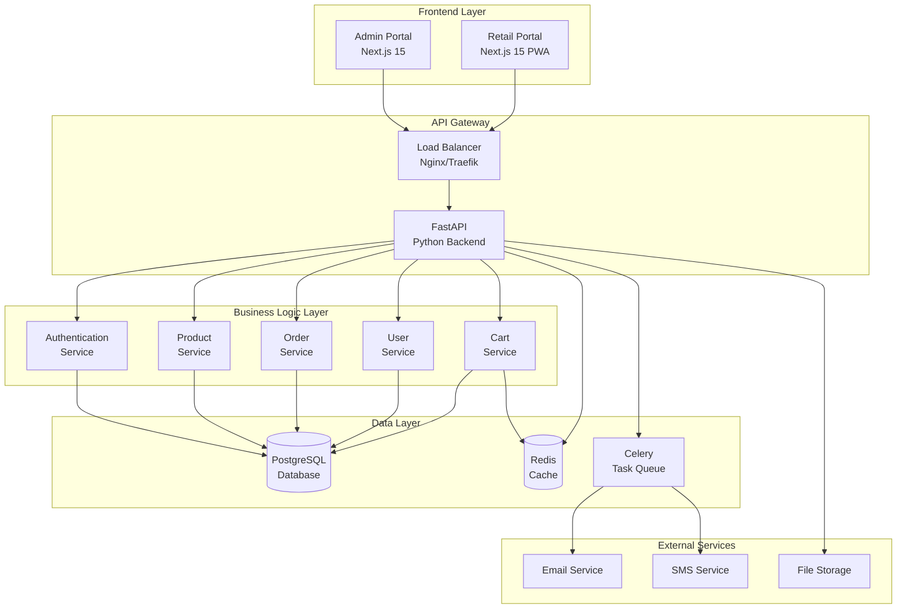

# Python Migration Plan

This document provides a comprehensive migration strategy for transitioning the Livrili backend from TypeScript/tRPC/Supabase to a Python-based architecture.

## Executive Summary

### Migration Scope
- **From**: TypeScript + tRPC + Supabase (PostgreSQL)
- **To**: Python Backend + Next.js Frontend + PostgreSQL
- **Timeline**: 12-16 weeks estimated
- **Approach**: Gradual migration with parallel development and testing

### Key Benefits
1. **Technology Consolidation**: Unified backend language expertise
2. **Ecosystem Maturity**: Rich Python ecosystem for business applications
3. **Scalability**: Better performance and scaling options
4. **Maintainability**: Improved code organization and testing capabilities
5. **Team Alignment**: Leverage existing Python expertise

## Technology Stack Selection

### Recommended Python Framework: FastAPI

**Rationale**:
- **Performance**: High performance with async support (comparable to Node.js)
- **Type Safety**: Built-in Pydantic models for request/response validation
- **Documentation**: Automatic OpenAPI documentation generation
- **Modern Python**: Native async/await support with type hints
- **Community**: Growing ecosystem with excellent libraries

**Alternative Options Considered**:
- **Django REST Framework**: More heavyweight, excellent for complex admin features
- **Flask**: Lightweight but requires more configuration for enterprise features
- **Pyramid**: Good enterprise features but smaller community

### Core Technology Stack

| Component | Technology | Justification |
|-----------|------------|---------------|
| **Web Framework** | FastAPI | Performance, type safety, automatic documentation |
| **Database ORM** | SQLAlchemy 2.0 | Mature ORM with async support, migration capabilities |
| **Database** | PostgreSQL | Keep existing database, proven performance |
| **Authentication** | PyJWT + Custom | JWT token handling similar to current system |
| **Validation** | Pydantic | Type-safe request/response validation |
| **Async Runtime** | asyncio + uvloop | High-performance async processing |
| **Caching** | Redis | Session storage, cart caching, performance optimization |
| **Task Queue** | Celery | Background tasks (emails, reports, cleanup) |
| **Email** | Django-like email system | Multi-template email support |
| **Testing** | pytest + httpx | Comprehensive testing framework |
| **Documentation** | FastAPI + Swagger UI | Interactive API documentation |

### Additional Libraries

```python
# Core dependencies
fastapi>=0.104.0
sqlalchemy>=2.0.0
pydantic>=2.5.0
alembic>=1.12.0
asyncpg>=0.29.0
redis>=5.0.0
celery>=5.3.0
python-jose[cryptography]>=3.3.0
passlib[bcrypt]>=1.7.0
python-multipart>=0.0.6
uvicorn[standard]>=0.24.0

# Database and caching
psycopg2-binary>=2.9.0
redis>=5.0.0

# Email and communications
emails>=0.6.0
jinja2>=3.1.0

# File handling and utilities
python-slugify>=8.0.0
pillow>=10.0.0

# Testing and development
pytest>=7.4.0
httpx>=0.25.0
pytest-asyncio>=0.21.0
factory-boy>=3.3.0
```

## Architecture Overview

### System Architecture



### Directory Structure

```
livrili-backend/
├── app/
│   ├── __init__.py
│   ├── main.py                 # FastAPI application
│   ├── config.py               # Configuration settings
│   ├── dependencies.py         # Dependency injection
│   │
│   ├── api/
│   │   ├── __init__.py
│   │   ├── deps.py             # API dependencies
│   │   └── v1/                 # API version 1
│   │       ├── __init__.py
│   │       ├── api.py          # API router aggregation
│   │       └── endpoints/
│   │           ├── auth.py
│   │           ├── products.py
│   │           ├── orders.py
│   │           ├── users.py
│   │           └── retailers.py
│   │
│   ├── core/
│   │   ├── __init__.py
│   │   ├── auth.py             # Authentication logic
│   │   ├── security.py         # Security utilities
│   │   ├── config.py           # Core configuration
│   │   └── exceptions.py       # Custom exceptions
│   │
│   ├── crud/
│   │   ├── __init__.py
│   │   ├── base.py             # Base CRUD operations
│   │   ├── product.py
│   │   ├── order.py
│   │   ├── user.py
│   │   └── retailer.py
│   │
│   ├── models/
│   │   ├── __init__.py
│   │   ├── base.py             # Base model class
│   │   ├── user.py
│   │   ├── product.py
│   │   ├── order.py
│   │   └── retailer.py
│   │
│   ├── schemas/
│   │   ├── __init__.py
│   │   ├── user.py             # Pydantic schemas
│   │   ├── product.py
│   │   ├── order.py
│   │   └── retailer.py
│   │
│   ├── services/
│   │   ├── __init__.py
│   │   ├── auth_service.py
│   │   ├── order_service.py
│   │   ├── cart_service.py
│   │   ├── email_service.py
│   │   └── notification_service.py
│   │
│   ├── utils/
│   │   ├── __init__.py
│   │   ├── database.py         # Database utilities
│   │   ├── cache.py            # Redis utilities
│   │   ├── i18n.py             # Internationalization
│   │   └── helpers.py          # General utilities
│   │
│   └── tasks/
│       ├── __init__.py
│       ├── celery_app.py       # Celery configuration
│       ├── email_tasks.py
│       └── cleanup_tasks.py
│
├── alembic/                    # Database migrations
│   ├── versions/
│   ├── env.py
│   └── script.py.mako
│
├── tests/
│   ├── __init__.py
│   ├── conftest.py             # Test configuration
│   ├── test_auth.py
│   ├── test_products.py
│   ├── test_orders.py
│   └── factories/              # Test data factories
│
├── docker/
│   ├── Dockerfile
│   ├── docker-compose.yml
│   └── entrypoint.sh
│
├── requirements/
│   ├── base.txt
│   ├── development.txt
│   └── production.txt
│
└── scripts/
    ├── migrate_data.py
    ├── seed_database.py
    └── backup_restore.py
```

## Migration Strategy

### Phase 1: Foundation Setup (Weeks 1-2)

#### Goals
- Set up Python development environment
- Create core FastAPI application structure
- Establish database connectivity and ORM models
- Implement basic authentication system

#### Tasks
1. **Environment Setup**
   - Set up Python virtual environment
   - Configure FastAPI project structure
   - Set up development database connection
   - Configure Redis for caching

2. **Core Models**
   - Create SQLAlchemy models matching existing schema
   - Implement Pydantic schemas for API validation
   - Set up Alembic for database migrations
   - Create base CRUD operations

3. **Authentication Foundation**
   - Implement JWT token handling
   - Create user authentication endpoints
   - Set up authorization middleware
   - Implement role-based access control

4. **Basic API Structure**
   - Create API router structure
   - Implement basic health check endpoints
   - Set up OpenAPI documentation
   - Configure CORS and security headers

#### Deliverables
- Working FastAPI application with basic structure
- Database models and migrations
- Authentication system with JWT
- Basic API documentation

### Phase 2: Core Business Logic (Weeks 3-6)

#### Goals
- Implement product management system
- Create shopping cart functionality
- Develop order processing workflow
- Establish user management system

#### Tasks
1. **Product Management**
   - Product CRUD operations
   - Category management with hierarchy
   - Multi-language content support
   - Product tagging system
   - Inventory management

2. **Cart System**
   - Shopping cart operations
   - Cart persistence with Redis
   - Real-time cart calculations
   - Offline cart synchronization

3. **Order Processing**
   - Order creation workflow
   - Order status management
   - Financial calculations
   - Stock reservation system

4. **User Management**
   - User profile management
   - Retailer registration and approval
   - Credit system implementation
   - Role and permission management

#### Deliverables
- Complete product management API
- Functional shopping cart system
- Order processing workflow
- User and retailer management

### Phase 3: Advanced Features (Weeks 7-10)

#### Goals
- Implement delivery management
- Create analytics and reporting
- Develop communication system
- Add bulk operations and data import/export

#### Tasks
1. **Delivery System**
   - Delivery creation and assignment
   - Driver management
   - Route optimization
   - Delivery tracking

2. **Analytics & Reporting**
   - Business metrics calculation
   - Report generation
   - Dashboard API endpoints
   - Data aggregation services

3. **Communication System**
   - Email template system
   - SMS integration
   - Notification preferences
   - Bulk communication capabilities

4. **Data Management**
   - Bulk import/export functionality
   - Data validation and cleansing
   - Backup and restore procedures
   - Migration utilities

#### Deliverables
- Delivery management system
- Analytics and reporting APIs
- Communication infrastructure
- Data import/export capabilities

### Phase 4: Performance & Production (Weeks 11-14)

#### Goals
- Optimize performance and caching
- Implement comprehensive testing
- Set up monitoring and logging
- Prepare for production deployment

#### Tasks
1. **Performance Optimization**
   - Database query optimization
   - Implement strategic caching
   - Add connection pooling
   - Optimize API response times

2. **Testing Infrastructure**
   - Unit test coverage
   - Integration tests
   - Load testing
   - Security testing

3. **Monitoring & Logging**
   - Application monitoring
   - Error tracking and alerting
   - Performance metrics
   - Audit logging

4. **Production Preparation**
   - Docker containerization
   - CI/CD pipeline setup
   - Security hardening
   - Documentation completion

#### Deliverables
- Optimized application performance
- Comprehensive test suite
- Monitoring and logging infrastructure
- Production-ready deployment

### Phase 5: Migration & Deployment (Weeks 15-16)

#### Goals
- Execute data migration from current system
- Perform parallel testing
- Execute production cutover
- Monitor post-migration stability

#### Tasks
1. **Data Migration**
   - Create migration scripts
   - Migrate historical data
   - Validate data integrity
   - Performance testing with real data

2. **Parallel Testing**
   - Run both systems in parallel
   - Compare API responses
   - Performance benchmarking
   - User acceptance testing

3. **Production Cutover**
   - Deploy to production environment
   - Execute DNS/traffic switchover
   - Monitor system stability
   - Address any immediate issues

4. **Post-Migration**
   - Performance monitoring
   - Bug fixes and optimizations
   - User feedback collection
   - Documentation updates

#### Deliverables
- Successfully migrated production system
- Validated data integrity
- Stable production operation
- Complete documentation

## Data Migration Strategy

### Migration Approach

1. **Schema Migration**
   - Use Alembic to create Python/SQLAlchemy compatible schema
   - Preserve existing data and relationships
   - Add any new indexes or optimizations

2. **Data Transfer**
   - Create automated migration scripts
   - Implement data validation and verification
   - Handle any data transformation needs
   - Preserve historical data integrity

3. **Testing Strategy**
   - Migrate data to staging environment
   - Run comprehensive data validation tests
   - Performance testing with real data volumes
   - User acceptance testing

### Migration Scripts

```python
# Example migration script structure
import asyncio
from sqlalchemy.ext.asyncio import AsyncSession
from app.utils.database import get_async_db
from app.models import User, Product, Order
from app.crud import user_crud, product_crud

async def migrate_users(db: AsyncSession):
    """Migrate user data from current system"""
    # Fetch data from current system
    # Transform to new format
    # Insert into new system
    # Validate migration success
    pass

async def migrate_products(db: AsyncSession):
    """Migrate product catalog"""
    pass

async def main():
    async for db in get_async_db():
        await migrate_users(db)
        await migrate_products(db)
        # ... other migrations
```

## API Migration Mapping

### Endpoint Mapping Strategy

| Current tRPC Procedure | New FastAPI Endpoint | Notes |
|------------------------|---------------------|--------|
| `products.list` | `GET /api/v1/products` | Query parameters for filtering |
| `products.getById` | `GET /api/v1/products/{id}` | Path parameter |
| `products.create` | `POST /api/v1/products` | Request body validation |
| `orders.getAll` | `GET /api/v1/orders` | Admin only, pagination |
| `retailer.cart.getCart` | `GET /api/v1/retailers/cart` | Retailer specific |
| `retailer.cart.addToCart` | `POST /api/v1/retailers/cart/items` | Cart item creation |

### Response Format Standardization

```python
# Standard API response format
class APIResponse(BaseModel):
    success: bool = True
    data: Optional[Any] = None
    message: Optional[str] = None
    errors: Optional[List[str]] = None
    pagination: Optional[PaginationInfo] = None

# Error response format
class ErrorResponse(BaseModel):
    success: bool = False
    error_code: str
    message: str
    details: Optional[Dict[str, Any]] = None
```

## Testing Strategy

### Test Coverage Requirements
- **Unit Tests**: 90%+ coverage for business logic
- **Integration Tests**: All API endpoints
- **End-to-End Tests**: Critical user workflows
- **Performance Tests**: API response times and throughput
- **Security Tests**: Authentication and authorization

### Test Implementation

```python
# Example test structure
import pytest
from httpx import AsyncClient
from app.main import app
from tests.factories import UserFactory, ProductFactory

@pytest.mark.asyncio
async def test_create_product():
    async with AsyncClient(app=app, base_url="http://test") as client:
        product_data = {
            "sku": "TEST-001",
            "name_en": "Test Product",
            "name_ar": "منتج تجريبي",
            "name_fr": "Produit Test",
            "base_price": 100.00
        }
        
        response = await client.post(
            "/api/v1/products",
            json=product_data,
            headers={"Authorization": f"Bearer {admin_token}"}
        )
        
        assert response.status_code == 201
        assert response.json()["data"]["sku"] == "TEST-001"
```

## Performance Considerations

### Performance Targets
- **API Response Time**: <200ms for 95% of requests
- **Database Query Time**: <50ms for simple queries
- **Cart Operations**: <100ms for cart updates
- **Order Processing**: <500ms for order creation
- **Concurrent Users**: Support 1000+ concurrent users

### Optimization Strategies

1. **Database Optimization**
   - Connection pooling with asyncpg
   - Query optimization and indexing
   - Read replicas for read-heavy operations
   - Database query caching

2. **Application Caching**
   - Redis for session storage
   - Cart data caching
   - Product catalog caching
   - User permission caching

3. **Async Processing**
   - Async/await for I/O operations
   - Background tasks with Celery
   - Non-blocking database operations
   - Concurrent request processing

## Security Implementation

### Security Measures

1. **Authentication & Authorization**
   - JWT token validation
   - Role-based access control
   - Session management
   - Token refresh mechanism

2. **Input Validation**
   - Pydantic model validation
   - SQL injection prevention
   - XSS protection
   - File upload validation

3. **Data Protection**
   - Sensitive data encryption
   - Secure password hashing
   - HTTPS enforcement
   - CORS configuration

4. **Monitoring & Auditing**
   - Request logging
   - Security event monitoring
   - Audit trail implementation
   - Error tracking

## Deployment Strategy

### Containerization

```dockerfile
# Dockerfile example
FROM python:3.11-slim

WORKDIR /app

# Install system dependencies
RUN apt-get update && apt-get install -y \
    postgresql-client \
    && rm -rf /var/lib/apt/lists/*

# Install Python dependencies
COPY requirements/ requirements/
RUN pip install -r requirements/production.txt

# Copy application code
COPY app/ app/
COPY alembic/ alembic/
COPY alembic.ini .

# Run application
CMD ["uvicorn", "app.main:app", "--host", "0.0.0.0", "--port", "8000"]
```

### Production Environment

1. **Infrastructure**
   - Docker containers with orchestration
   - Load balancer (Nginx/Traefik)
   - Database cluster setup
   - Redis cluster for caching

2. **Monitoring**
   - Application performance monitoring
   - Infrastructure monitoring
   - Log aggregation and analysis
   - Health check endpoints

3. **Scaling**
   - Horizontal scaling capability
   - Auto-scaling based on load
   - Database read replicas
   - CDN for static assets

## Risk Management

### Technical Risks

| Risk | Probability | Impact | Mitigation |
|------|-------------|---------|------------|
| Performance degradation | Medium | High | Comprehensive performance testing |
| Data migration issues | Medium | High | Extensive testing and rollback plan |
| Security vulnerabilities | Low | High | Security audits and testing |
| Integration problems | Medium | Medium | Parallel development and testing |

### Business Risks

| Risk | Probability | Impact | Mitigation |
|------|-------------|---------|------------|
| Extended downtime | Low | High | Careful migration planning |
| Feature regression | Medium | Medium | Comprehensive testing |
| User experience degradation | Low | Medium | User acceptance testing |
| Timeline delays | Medium | Medium | Agile methodology and buffer time |

## Success Criteria

### Technical Criteria
- ✅ All current functionality preserved
- ✅ Performance meets or exceeds current system
- ✅ 99.9% uptime during migration
- ✅ All tests passing with >90% coverage
- ✅ Security audit passed

### Business Criteria
- ✅ Zero data loss during migration
- ✅ No business disruption
- ✅ User satisfaction maintained
- ✅ System ready for future enhancements
- ✅ Documentation complete and accurate

---

*This migration plan provides a comprehensive roadmap for successfully transitioning from the TypeScript/tRPC system to a robust Python-based backend. The phased approach ensures minimal business disruption while delivering improved performance and maintainability.*