# Retailers Portal User Flows

## Overview
This document outlines the detailed user flows for the Livrili retailers portal, designed for maximum simplicity and ease of use.

## 1. Registration Flow

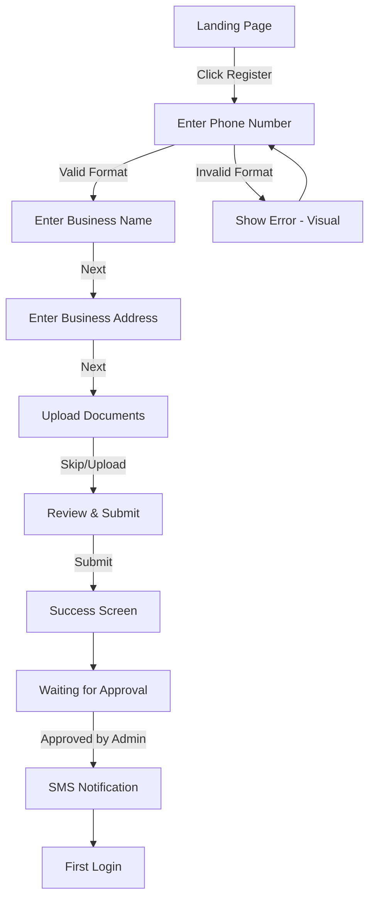

### Registration States
- **Phone Entry**: Large numeric keypad, auto-formatting
- **Business Info**: Single field per screen, progress bar
- **Document Upload**: Optional with "Skip for Now" option
- **Waiting**: Show estimated time (24-48 hours)
- **Approved**: SMS with username/password from admin

## 2. Login Flow

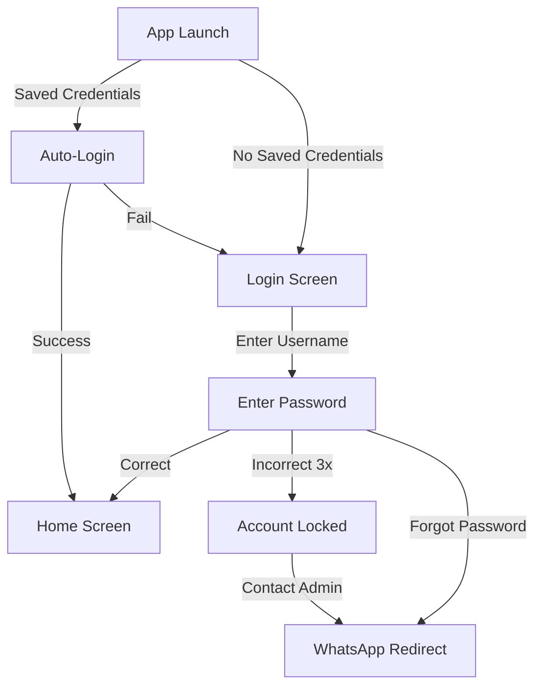

### Login Features
- Remember username on device
- Large touch targets for input
- Clear error messages with icons
- Direct WhatsApp support link

## 3. Product Browsing & Ordering Flow

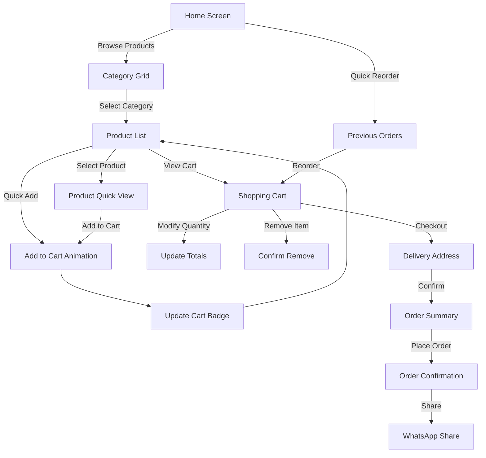

### Browsing Features
- Visual category cards (big icons)
- Infinite scroll product list
- Quick add without leaving list
- Visual feedback for all actions

## 4. Quick Reorder Flow

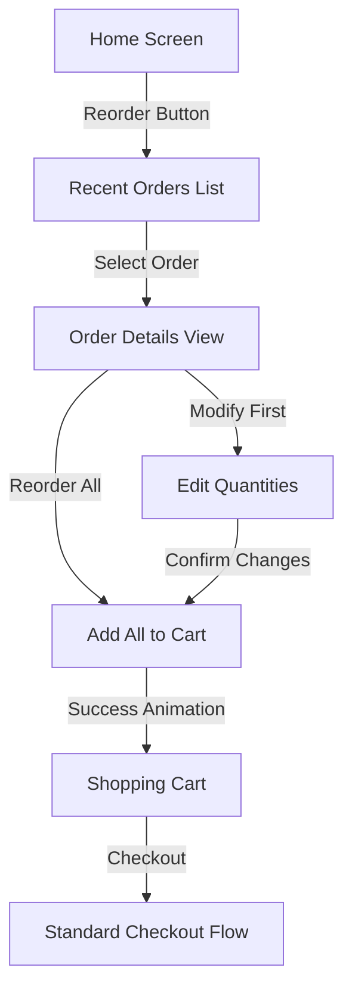

## 5. Cart & Checkout Flow

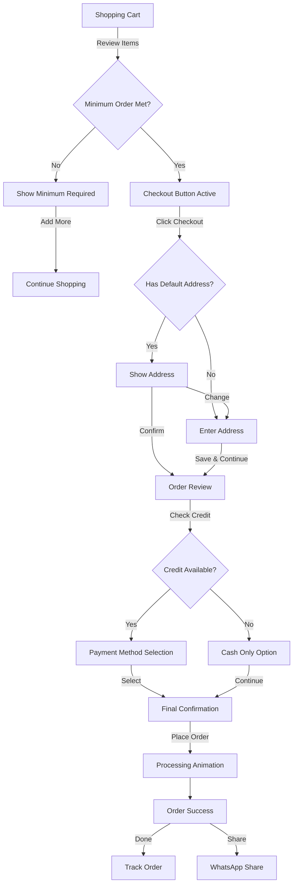

### Checkout Features
- Auto-calculate credit availability
- Visual payment method selection
- Clear order summary with images
- One-tap order placement

## 6. Order Management Flow

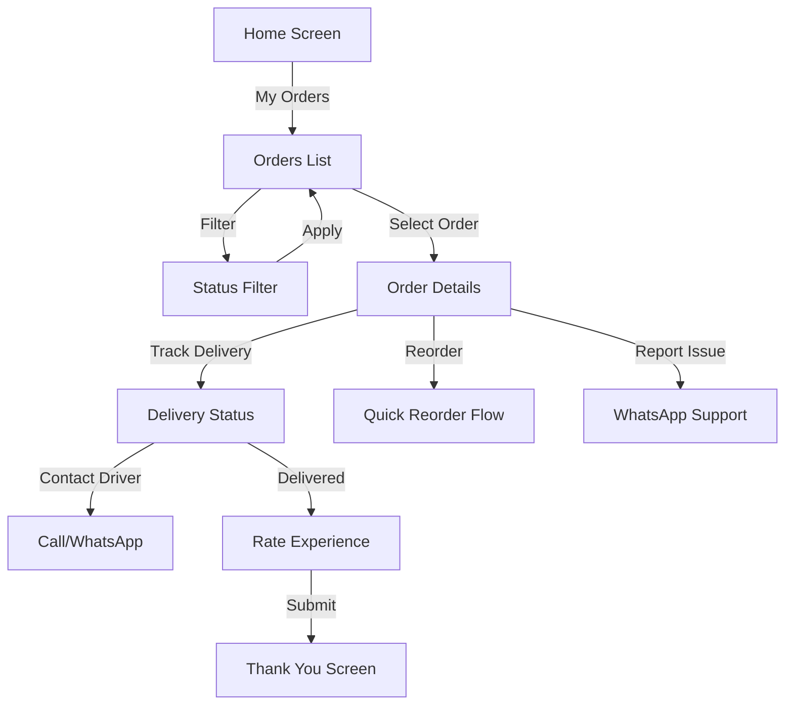

## 7. Credit Management Flow

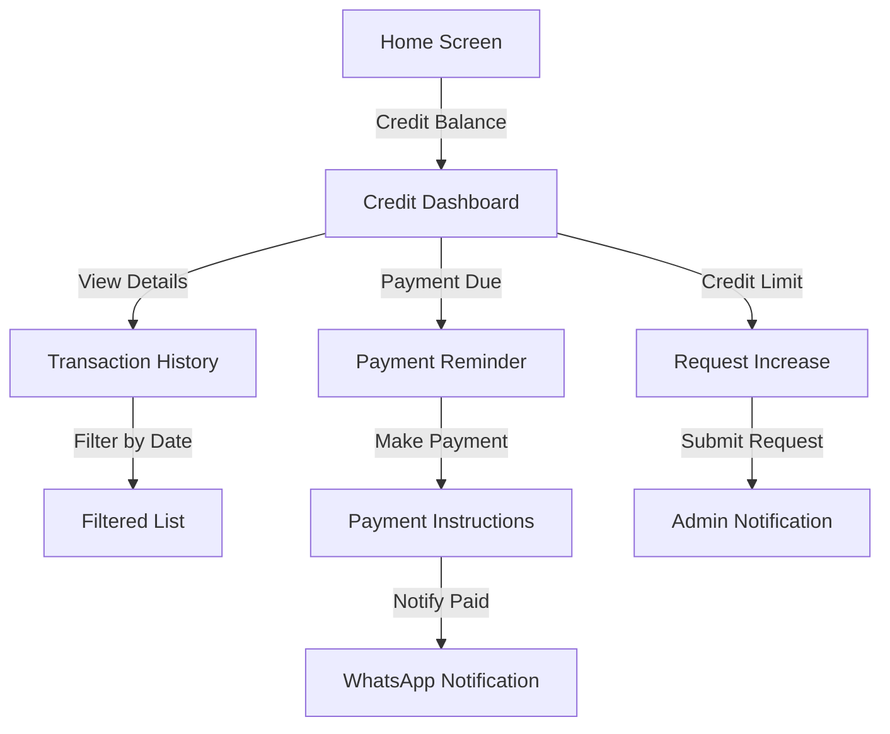

## Error Handling Patterns

### Network Errors
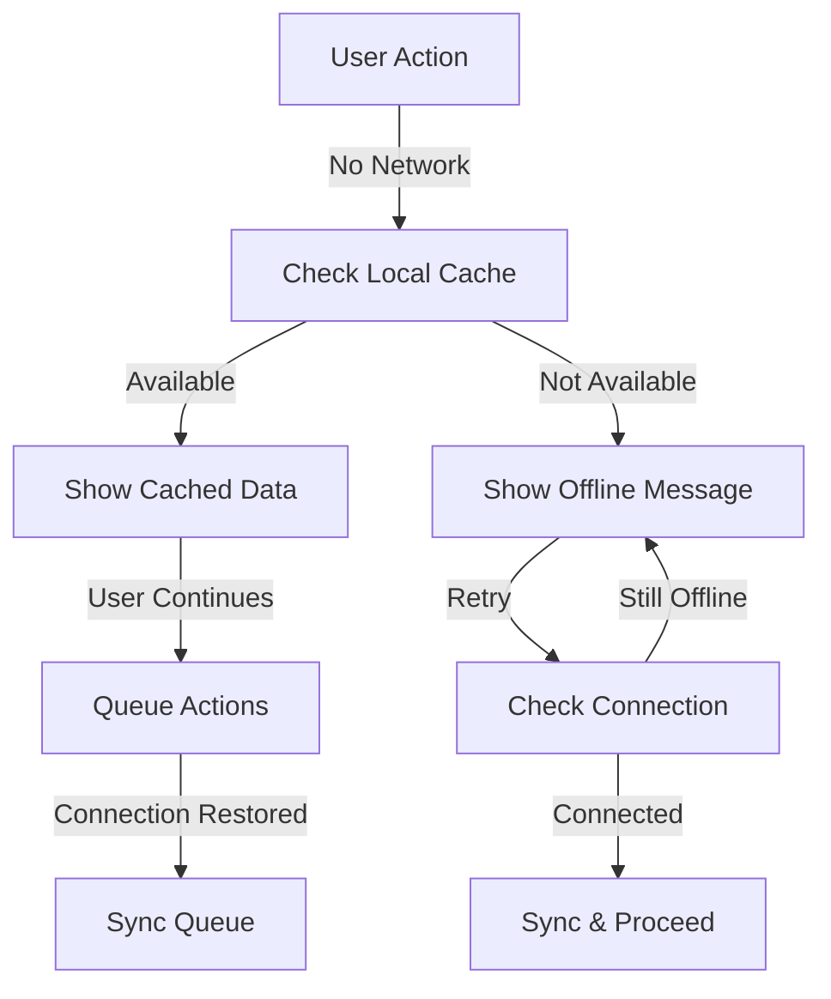

### Validation Errors
- Visual indicators (red borders)
- Icon-based error messages
- Inline correction suggestions
- Prevent submission until fixed

## Success Patterns

### Visual Feedback
1. **Add to Cart**: Item flies to cart with number bounce
2. **Order Placed**: Confetti animation + success sound
3. **Login Success**: Welcome message with name
4. **Registration**: Step completion checkmarks

### Confirmation Patterns
- Order confirmation with order number prominently displayed
- WhatsApp share button for order details
- SMS confirmation (when implemented)
- Email receipt (optional)

## Accessibility Flows

### Voice Navigation (Future)
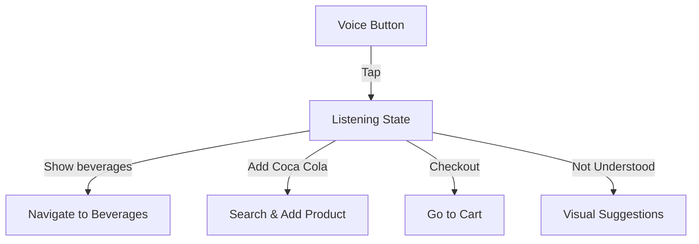

### High Contrast Mode
- Toggle in settings
- Persists across sessions
- Increases all contrast ratios
- Larger touch targets

## Performance Optimization Flows

### Progressive Loading
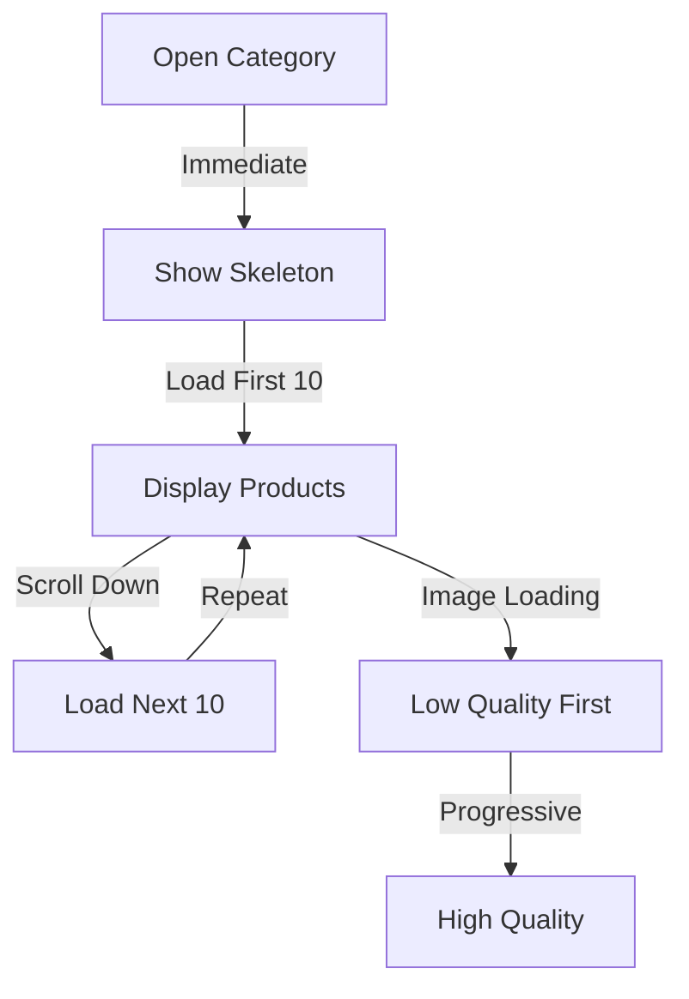

### Offline Queue
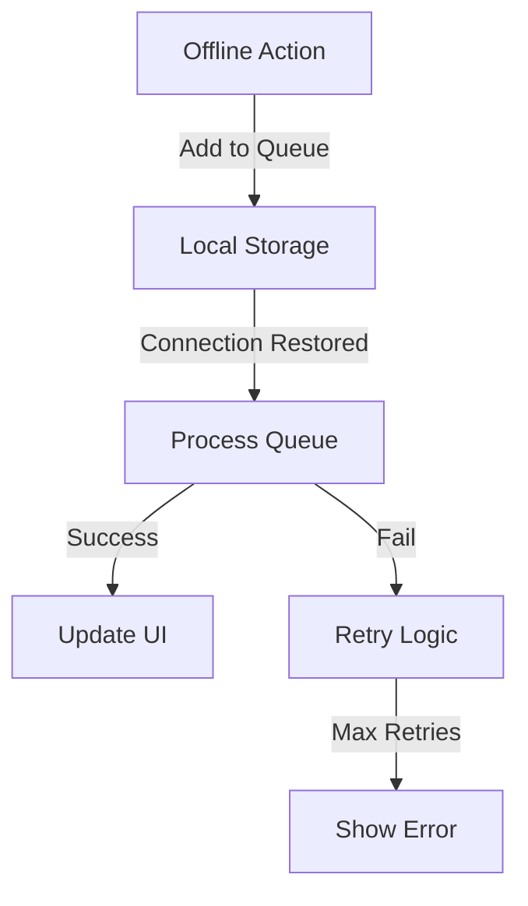

## Implementation Notes

### Technical Considerations
1. All flows must complete in ≤3 screens
2. Every action needs visual feedback
3. Error states should suggest solutions
4. Success states should be celebratory
5. Loading states need progress indicators

### UX Principles Applied
- **Simplicity**: One primary action per screen
- **Clarity**: Visual hierarchy guides users
- **Feedback**: Immediate response to all inputs
- **Forgiveness**: Easy to undo/go back
- **Efficiency**: Smart defaults reduce typing