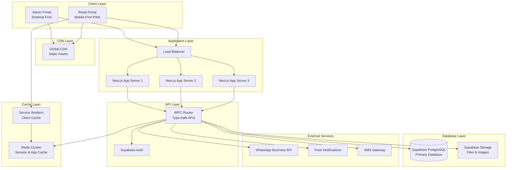
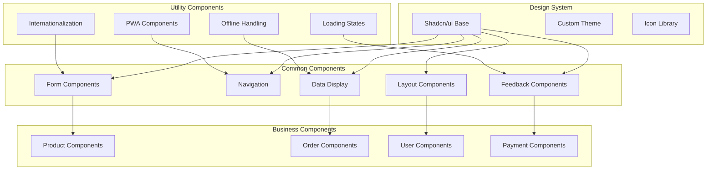
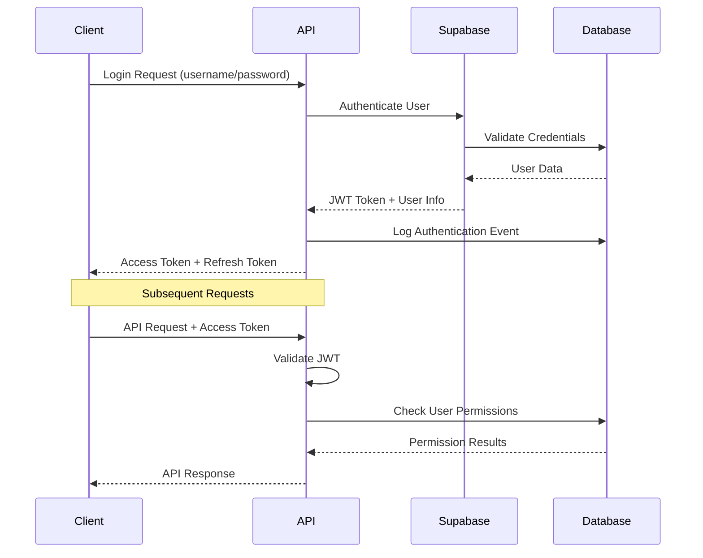
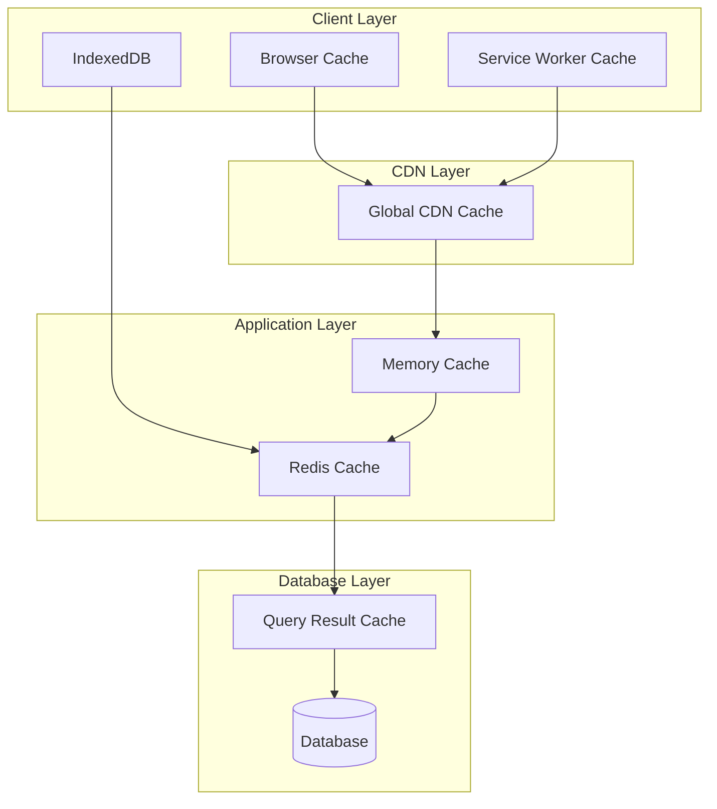
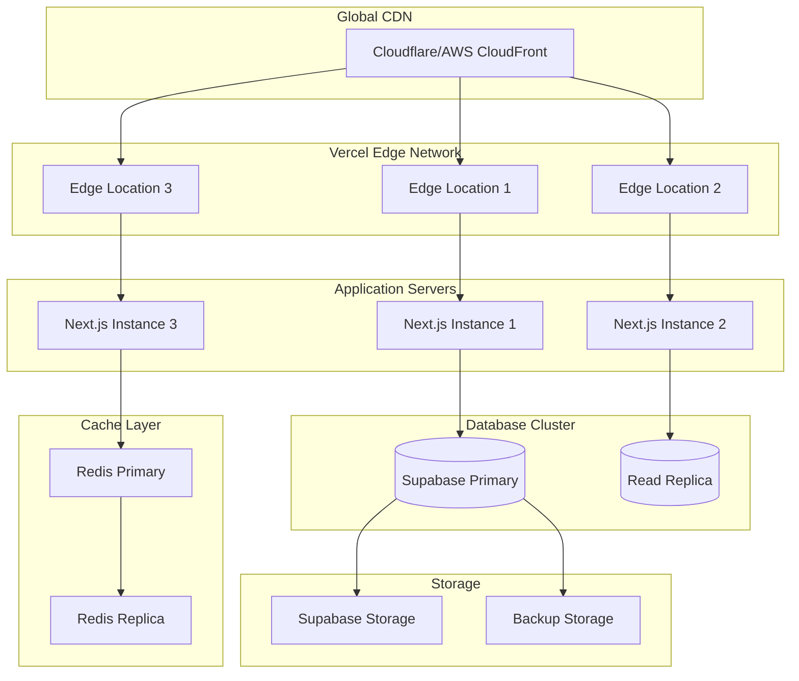
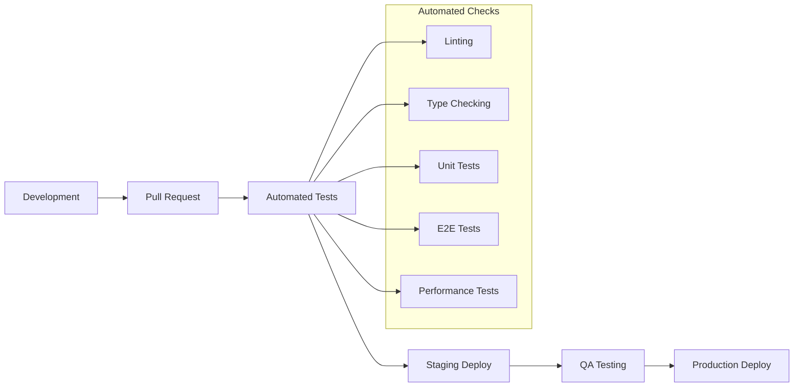

# Livrili MVP Architecture

## Executive Summary

This document outlines the comprehensive technical architecture for the Livrili MVP - a B2B marketplace platform connecting retailers and suppliers in Algeria. The architecture implements a two-portal system (Admin Portal and Retail Portal) built on modern web technologies with emphasis on mobile-first design, offline capabilities, and multi-language support.

## Table of Contents

- [System Overview](#system-overview)
- [High-Level Architecture](#high-level-architecture)
- [Frontend Architecture](#frontend-architecture)
- [Backend API Architecture](#backend-api-architecture)
- [Database Design](#database-design)
- [Authentication & Authorization](#authentication--authorization)
- [Caching & Performance Strategy](#caching--performance-strategy)
- [Deployment Architecture](#deployment-architecture)
- [Security Architecture](#security-architecture)
- [Integration Points](#integration-points)
- [Development Guidelines](#development-guidelines)

## System Overview

### Core Requirements

- **Two-Portal Architecture**: Admin Portal (desktop-first) and Retail Portal (mobile-first)
- **Mobile-First Design**: Progressive Web App with offline capabilities
- **Multi-Language Support**: Arabic (RTL), French, and English
- **Performance**: <3s load time on 3G networks
- **Cash-Based Economy**: Cash on delivery with credit management
- **Shared Accounts**: Multiple users per retailer account with activity tracking
- **Real-Time Updates**: Live dashboard and order status updates

### Technology Stack

```json
{
  "frontend": "Next.js 14 (App Router)",
  "api": "tRPC v11",
  "database": "Supabase (PostgreSQL)",
  "authentication": "Supabase Auth + Custom RBAC",
  "styling": "Tailwind CSS + Shadcn/ui",
  "pwa": "next-pwa + Workbox",
  "language": "TypeScript (strict mode)",
  "caching": "Redis + CDN",
  "deployment": "Vercel + Supabase Cloud"
}
```

## High-Level Architecture



## Frontend Architecture

### Monorepo Structure

```
livrili-app/
├── apps/
│   ├── admin-portal/          # Desktop-first admin interface
│   └── retail-portal/         # Mobile-first retailer PWA
├── packages/
│   ├── ui/                    # Shared Shadcn/ui components
│   ├── database/              # Supabase client & types
│   ├── api/                   # tRPC client & types
│   ├── auth/                  # Authentication utilities
│   ├── i18n/                  # Internationalization
│   └── utils/                 # Shared utilities
├── docs/
└── tools/
```

### Admin Portal Architecture

**Desktop-First Design Pattern**:
- Responsive grid layouts for complex data tables
- Multi-panel dashboards with real-time updates
- Advanced filtering and search capabilities
- Bulk operation interfaces
- Modal-based workflows for complex forms

**Key Features**:
- Real-time order status dashboard
- Analytics and reporting interfaces
- User and product management systems
- Financial tracking and credit management
- Document verification workflows

### Retail Portal Architecture

**Mobile-First PWA Pattern**:
- Touch-optimized navigation and interactions
- Offline-first data synchronization
- Progressive enhancement for poor network conditions
- Bottom navigation for core actions
- Gesture-based interactions

**Key Features**:
- Product catalog with search and filtering
- Shopping cart and checkout flow
- Order tracking and history
- Account and profile management
- Credit dashboard and payment tracking

### Shared Component Architecture



### Progressive Web App Implementation

**Service Worker Strategy**:
- Cache-first for static assets
- Network-first for dynamic content
- Background sync for critical operations
- Push notification handling

**Offline Capabilities**:
- Product catalog caching
- Order draft persistence
- Queue system for pending actions
- Conflict resolution on reconnection

**Performance Optimizations**:
- Route-based code splitting
- Component lazy loading
- Image optimization and lazy loading
- Critical CSS inlining
- Resource preloading

## Backend API Architecture

### tRPC Router Structure

```typescript
// Main router composition
export const appRouter = router({
  auth: authRouter,
  users: usersRouter,
  retailers: retailersRouter,
  products: productsRouter,
  orders: ordersRouter,
  payments: paymentsRouter,
  analytics: analyticsRouter,
  communications: communicationsRouter,
  admin: adminRouter,
});
```

### Domain-Driven Router Design

**Authentication Router** (`auth`):
- Login/logout procedures
- Session management
- Password reset workflow
- Role-based authorization checks

**Users Router** (`users`):
- User profile management
- Retailer account operations
- Activity logging
- Account sharing controls

**Products Router** (`products`):
- Product catalog management
- Category operations
- Inventory tracking
- Multi-language content handling

**Orders Router** (`orders`):
- Order lifecycle management
- Real-time status updates
- Bulk operations
- Order history and analytics

**Payments Router** (`payments`):
- Cash transaction tracking
- Credit management
- Invoice generation
- Financial reporting

### API Design Patterns

**Input Validation**:
```typescript
const createOrderSchema = z.object({
  retailerId: z.string().uuid(),
  items: z.array(z.object({
    productId: z.string().uuid(),
    quantity: z.number().positive(),
    unitPrice: z.number().positive(),
  })),
  deliveryAddress: z.string().min(1),
  notes: z.string().optional(),
});
```

**Response Standardization**:
```typescript
type ApiResponse<T> = {
  success: boolean;
  data?: T;
  error?: {
    code: string;
    message: string;
    details?: any;
  };
  meta?: {
    pagination?: PaginationMeta;
    timestamp: string;
  };
};
```

**Real-Time Subscriptions**:
- Order status updates
- Inventory changes
- Payment notifications
- System announcements

## Database Design

### Core Schema Design

```sql
-- Users and Authentication
CREATE TABLE users (
  id UUID PRIMARY KEY DEFAULT gen_random_uuid(),
  username VARCHAR(50) UNIQUE NOT NULL,
  email VARCHAR(255),
  password_hash VARCHAR(255) NOT NULL,
  role user_role NOT NULL DEFAULT 'retailer',
  retailer_id UUID REFERENCES retailers(id),
  is_active BOOLEAN DEFAULT true,
  last_login_at TIMESTAMPTZ,
  created_at TIMESTAMPTZ DEFAULT NOW(),
  updated_at TIMESTAMPTZ DEFAULT NOW()
);

-- Retailer Accounts
CREATE TABLE retailers (
  id UUID PRIMARY KEY DEFAULT gen_random_uuid(),
  business_name VARCHAR(255) NOT NULL,
  business_type VARCHAR(100),
  registration_number VARCHAR(100),
  tax_number VARCHAR(100),
  phone VARCHAR(20),
  address TEXT,
  credit_limit DECIMAL(10,2) DEFAULT 0,
  current_balance DECIMAL(10,2) DEFAULT 0,
  status retailer_status DEFAULT 'pending',
  approval_date TIMESTAMPTZ,
  created_at TIMESTAMPTZ DEFAULT NOW(),
  updated_at TIMESTAMPTZ DEFAULT NOW()
);

-- Product Catalog
CREATE TABLE products (
  id UUID PRIMARY KEY DEFAULT gen_random_uuid(),
  sku VARCHAR(100) UNIQUE NOT NULL,
  barcode VARCHAR(50),
  category_id UUID REFERENCES categories(id),
  base_price DECIMAL(10,2) NOT NULL,
  cost_price DECIMAL(10,2),
  stock_quantity INTEGER DEFAULT 0,
  min_stock_level INTEGER DEFAULT 0,
  is_active BOOLEAN DEFAULT true,
  created_at TIMESTAMPTZ DEFAULT NOW(),
  updated_at TIMESTAMPTZ DEFAULT NOW()
);

-- Product Translations
CREATE TABLE product_translations (
  id UUID PRIMARY KEY DEFAULT gen_random_uuid(),
  product_id UUID REFERENCES products(id) ON DELETE CASCADE,
  language_code VARCHAR(5) NOT NULL,
  name VARCHAR(255) NOT NULL,
  description TEXT,
  created_at TIMESTAMPTZ DEFAULT NOW(),
  UNIQUE(product_id, language_code)
);

-- Orders
CREATE TABLE orders (
  id UUID PRIMARY KEY DEFAULT gen_random_uuid(),
  order_number VARCHAR(50) UNIQUE NOT NULL,
  retailer_id UUID REFERENCES retailers(id),
  created_by_user_id UUID REFERENCES users(id),
  subtotal DECIMAL(10,2) NOT NULL,
  tax_amount DECIMAL(10,2) DEFAULT 0,
  total_amount DECIMAL(10,2) NOT NULL,
  status order_status DEFAULT 'pending',
  payment_method payment_method DEFAULT 'cash',
  delivery_address TEXT NOT NULL,
  delivery_date DATE,
  notes TEXT,
  created_at TIMESTAMPTZ DEFAULT NOW(),
  updated_at TIMESTAMPTZ DEFAULT NOW()
);

-- Order Items
CREATE TABLE order_items (
  id UUID PRIMARY KEY DEFAULT gen_random_uuid(),
  order_id UUID REFERENCES orders(id) ON DELETE CASCADE,
  product_id UUID REFERENCES products(id),
  quantity INTEGER NOT NULL,
  unit_price DECIMAL(10,2) NOT NULL,
  total_price DECIMAL(10,2) NOT NULL,
  created_at TIMESTAMPTZ DEFAULT NOW()
);

-- Payments and Transactions
CREATE TABLE payments (
  id UUID PRIMARY KEY DEFAULT gen_random_uuid(),
  order_id UUID REFERENCES orders(id),
  retailer_id UUID REFERENCES retailers(id),
  amount DECIMAL(10,2) NOT NULL,
  payment_type payment_type NOT NULL,
  payment_method payment_method NOT NULL,
  status payment_status DEFAULT 'pending',
  reference_number VARCHAR(100),
  collected_by_user_id UUID REFERENCES users(id),
  collected_at TIMESTAMPTZ,
  created_at TIMESTAMPTZ DEFAULT NOW()
);

-- Audit Logs
CREATE TABLE audit_logs (
  id UUID PRIMARY KEY DEFAULT gen_random_uuid(),
  user_id UUID REFERENCES users(id),
  action VARCHAR(100) NOT NULL,
  resource_type VARCHAR(50) NOT NULL,
  resource_id UUID,
  old_values JSONB,
  new_values JSONB,
  ip_address INET,
  user_agent TEXT,
  created_at TIMESTAMPTZ DEFAULT NOW()
);
```

### Database Optimization

**Indexing Strategy**:
```sql
-- Performance indexes
CREATE INDEX idx_orders_retailer_status ON orders(retailer_id, status);
CREATE INDEX idx_orders_created_at ON orders(created_at DESC);
CREATE INDEX idx_products_category_active ON products(category_id, is_active);
CREATE INDEX idx_audit_logs_user_date ON audit_logs(user_id, created_at DESC);

-- Search indexes
CREATE INDEX idx_products_search ON product_translations USING GIN(to_tsvector('english', name || ' ' || COALESCE(description, '')));
CREATE INDEX idx_retailers_search ON retailers USING GIN(to_tsvector('english', business_name));
```

**Row Level Security (RLS)**:
```sql
-- Enable RLS
ALTER TABLE orders ENABLE ROW LEVEL SECURITY;
ALTER TABLE payments ENABLE ROW LEVEL SECURITY;

-- Retailer can only access their own data
CREATE POLICY retailer_orders_policy ON orders
  FOR ALL USING (retailer_id = auth.jwt() ->> 'retailer_id'::text);

-- Admin can access all data
CREATE POLICY admin_orders_policy ON orders
  FOR ALL USING (auth.jwt() ->> 'role'::text = 'admin');
```

## Authentication & Authorization

### Authentication Flow



### Role-Based Access Control (RBAC)

**Role Definitions**:
```typescript
enum UserRole {
  ADMIN = 'admin',
  RETAILER = 'retailer',
  DRIVER = 'driver' // Future implementation
}

type Permission = {
  resource: string;
  actions: ('create' | 'read' | 'update' | 'delete')[];
};

const rolePermissions: Record<UserRole, Permission[]> = {
  [UserRole.ADMIN]: [
    { resource: '*', actions: ['create', 'read', 'update', 'delete'] }
  ],
  [UserRole.RETAILER]: [
    { resource: 'orders', actions: ['create', 'read'] },
    { resource: 'products', actions: ['read'] },
    { resource: 'profile', actions: ['read', 'update'] }
  ],
  [UserRole.DRIVER]: [
    { resource: 'deliveries', actions: ['read', 'update'] }
  ]
};
```

### Shared Account Management

**User Session Tracking**:
```typescript
type UserSession = {
  userId: string;
  retailerId: string;
  deviceId: string;
  ipAddress: string;
  userAgent: string;
  loginTime: Date;
  lastActivity: Date;
  isActive: boolean;
};
```

**Activity Logging**:
```typescript
type AuditLog = {
  userId: string;
  action: string;
  resourceType: string;
  resourceId: string;
  oldValues?: any;
  newValues?: any;
  timestamp: Date;
  ipAddress: string;
  userAgent: string;
};
```

## Caching & Performance Strategy

### Multi-Layer Caching Architecture



### Caching Strategies

**Static Assets**:
- CDN caching with long TTL (1 year)
- Versioned asset URLs for cache busting
- Progressive image formats (WebP, AVIF)
- Optimized bundle sizes with tree shaking

**API Responses**:
```typescript
// Cache configuration
const cacheConfig = {
  products: { ttl: 300, tags: ['products'] }, // 5 minutes
  categories: { ttl: 3600, tags: ['categories'] }, // 1 hour
  orders: { ttl: 60, tags: ['orders'] }, // 1 minute
  analytics: { ttl: 1800, tags: ['analytics'] }, // 30 minutes
};
```

**Database Query Optimization**:
- Prepared statements for common queries
- Connection pooling
- Read replicas for analytics
- Query result caching with Redis

### Offline-First Strategy

**Service Worker Implementation**:
```typescript
// Cache strategies
const cacheStrategies = {
  static: 'CacheFirst',
  api: 'NetworkFirst',
  images: 'CacheFirst',
  critical: 'StaleWhileRevalidate'
};

// Background sync for critical operations
self.addEventListener('sync', event => {
  if (event.tag === 'order-sync') {
    event.waitUntil(syncPendingOrders());
  }
});
```

**Data Synchronization**:
- Optimistic updates with rollback
- Conflict resolution strategies
- Incremental sync for large datasets
- Background sync queue

## Deployment Architecture

### Production Infrastructure



### Environment Configuration

**Development Environment**:
- Local Next.js development servers
- Local Supabase instance
- Local Redis instance
- Hot module replacement
- Debug logging enabled

**Staging Environment**:
- Production-like configuration
- Staging database with anonymized data
- Integration testing suite
- Performance monitoring
- Staging-specific environment variables

**Production Environment**:
- Multi-region deployment
- Auto-scaling configuration
- Database backups and monitoring
- Error tracking and alerting
- Performance monitoring
- Security scanning

### Deployment Pipeline



## Security Architecture

### Security Layers

**Application Security**:
- Input validation and sanitization
- XSS protection with Content Security Policy
- CSRF protection with tokens
- SQL injection prevention with parameterized queries
- Rate limiting and DDoS protection

**Data Security**:
- Encryption at rest and in transit
- Database-level encryption for sensitive fields
- Secure file upload with virus scanning
- Data anonymization for development

**Access Security**:
- JWT token validation
- Role-based access control
- Session management with Redis
- IP whitelisting for admin accounts
- Multi-factor authentication for sensitive operations

**Infrastructure Security**:
- HTTPS enforcement
- Security headers configuration
- Regular security updates
- Vulnerability scanning
- Network isolation

### Compliance & Privacy

**Data Protection**:
- GDPR compliance for data handling
- Data retention policies
- Right to deletion implementation
- Privacy policy and consent management

**Audit & Compliance**:
- Comprehensive audit logging
- Compliance reporting
- Security incident response procedures
- Regular security assessments

## Integration Points

### External Service Integration

**WhatsApp Business API**:
```typescript
// WhatsApp integration
export class WhatsAppService {
  async sendOrderNotification(phone: string, order: Order) {
    const message = await this.formatOrderMessage(order);
    return this.client.messages.create({
      to: phone,
      template: 'order_confirmation',
      language: 'ar',
      components: message
    });
  }
}
```

**Push Notifications**:
```typescript
// Push notification service
export class PushNotificationService {
  async sendToUser(userId: string, notification: Notification) {
    const subscription = await this.getUserSubscription(userId);
    return webpush.sendNotification(subscription, JSON.stringify(notification));
  }
}
```

**SMS Gateway**:
```typescript
// SMS service for critical notifications
export class SMSService {
  async sendOrderUpdate(phone: string, orderId: string, status: string) {
    return this.provider.sendSMS({
      to: phone,
      message: `Order ${orderId} status: ${status}`,
      messageType: 'transactional'
    });
  }
}
```

### Future Integration Possibilities

**Payment Gateways**:
- Credit card processing
- Mobile payment integration
- Bank transfer APIs
- Digital wallet support

**Logistics Partners**:
- Third-party delivery services
- GPS tracking integration
- Route optimization APIs
- Delivery confirmation systems

**Business Intelligence**:
- Advanced analytics platforms
- Business intelligence tools
- Machine learning services
- Predictive analytics

## Development Guidelines

### Code Organization

**File Structure Conventions**:
```
src/
├── components/          # Reusable UI components
├── pages/              # Next.js pages/routes
├── lib/                # Utility libraries
├── hooks/              # Custom React hooks
├── stores/             # State management
├── types/              # TypeScript type definitions
├── utils/              # Helper functions
└── styles/             # Global styles
```

**Naming Conventions**:
- PascalCase for components and types
- camelCase for functions and variables
- kebab-case for file names
- SCREAMING_SNAKE_CASE for constants

### Development Workflow

**Git Workflow**:
1. Feature branches from main
2. Pull request reviews required
3. Automated testing before merge
4. Squash and merge for clean history

**Code Quality**:
- ESLint and Prettier configuration
- Husky pre-commit hooks
- TypeScript strict mode
- Jest testing framework
- Playwright E2E testing

**Documentation**:
- JSDoc comments for complex functions
- README files for each package
- API documentation with OpenAPI
- Architecture decision records (ADRs)

### Performance Guidelines

**Frontend Performance**:
- Bundle size monitoring
- Core Web Vitals tracking
- Lighthouse CI integration
- Performance budgets enforcement

**Backend Performance**:
- Database query monitoring
- API response time tracking
- Memory usage optimization
- Cache hit rate monitoring

### Testing Strategy

**Unit Testing**:
- Component testing with React Testing Library
- Utility function testing
- Business logic testing
- 80%+ code coverage target

**Integration Testing**:
- API endpoint testing
- Database integration testing
- Third-party service mocking
- Error handling scenarios

**End-to-End Testing**:
- Critical user journey testing
- Cross-browser compatibility
- Mobile device testing
- Performance testing

## Conclusion

This architecture provides a robust, scalable foundation for the Livrili MVP while addressing all key requirements:

✅ **Two-Portal Architecture**: Separate optimized applications sharing common infrastructure
✅ **Mobile-First Design**: PWA implementation with offline capabilities
✅ **Multi-Language Support**: Internationalization with RTL support
✅ **Performance**: Optimized for 3G networks with comprehensive caching
✅ **Security**: Multi-layer security with RBAC and audit logging
✅ **Scalability**: Cloud-native architecture with auto-scaling capabilities

The architecture is designed to support the current MVP requirements while providing a foundation for future growth and feature expansion.